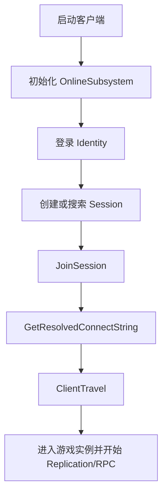
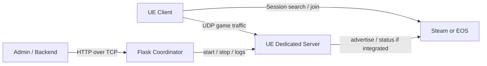

# UE Multiplayer Blog Series Implementation Plan

> **For agentic workers:** REQUIRED SUB-SKILL: Use superpowers:subagent-driven-development (recommended) or superpowers:executing-plans to implement this plan task-by-task. Steps use checkbox (`- [ ]`) syntax for tracking.

**Goal:** Build a two-part MDX blog series about UE 5.6 OnlineSubsystem/EOS/Steam multiplayer and Dedicated Server deployment with Docker, WSL/Ubuntu, and a Python Flask Coordinator.

**Architecture:** Add reusable article UI components first, then add maintainable example code under `examples/`, then write the two MDX posts that reference the examples. The articles use clean technical prose, limited handbook-style tables, Mermaid diagrams, Rider/Visual-Studio-like code styling, TOC, series navigation, and polished collapsible code panels.

**Tech Stack:** Astro 6, MDX, TypeScript, CSS, Shiki/Markdown syntax highlighting, Mermaid diagrams, UE 5.6 C++ OnlineSubsystem examples, Python Flask, Dockerfile, Docker Compose.

---

## File Structure

- Modify: `E:\Web博客\7-lovski.github.io\astro.config.mjs`
  - Configure Markdown syntax highlighting and Mermaid support if needed.
- Modify: `E:\Web博客\7-lovski.github.io\src\layouts\BlogPost.astro`
  - Add article TOC slot/prop rendering, wider technical article layout, and series navigation support.
- Create: `E:\Web博客\7-lovski.github.io\src\components\CodeFold.astro`
  - Styled collapsible panel for long code blocks and complete examples.
- Create: `E:\Web博客\7-lovski.github.io\src\components\SeriesNav.astro`
  - Previous/next navigation for UE multiplayer series articles.
- Create: `E:\Web博客\7-lovski.github.io\src\components\TableOfContents.astro`
  - Render headings from Astro content when available.
- Modify: `E:\Web博客\7-lovski.github.io\src\styles\global.css`
  - Add technical article typography, Rider/Visual-Studio-like code block styling, tables, callouts, Mermaid containers, and fold panels.
- Create: `E:\Web博客\7-lovski.github.io\examples\ue-online-subsystem\OnlineSessionManager.h`
  - Complete UE C++ header example for OnlineSubsystem session flow.
- Create: `E:\Web博客\7-lovski.github.io\examples\ue-online-subsystem\OnlineSessionManager.cpp`
  - Complete UE C++ implementation example for login, create, search, join, travel, and errors.
- Create: `E:\Web博客\7-lovski.github.io\examples\ue-dedicated-server-coordinator\app.py`
  - Flask Coordinator example with `X-Admin-Token`, port pool, process management, room lifecycle, logs, and health check.
- Create: `E:\Web博客\7-lovski.github.io\examples\ue-dedicated-server-coordinator\requirements.txt`
  - Minimal Python dependencies.
- Create: `E:\Web博客\7-lovski.github.io\examples\ue-dedicated-server-coordinator\Dockerfile`
  - Docker image for an already-packaged UE Dedicated Server.
- Create: `E:\Web博客\7-lovski.github.io\examples\ue-dedicated-server-coordinator\docker-compose.yml`
  - Coordinator service and documented server artifact volume/port assumptions.
- Create: `E:\Web博客\7-lovski.github.io\src\content\blog\ue-online-subsystem-steam-eos-multiplayer.mdx`
  - First article in the series.
- Create: `E:\Web博客\7-lovski.github.io\src\content\blog\ue-dedicated-server-docker-python-coordinator.mdx`
  - Second article in the series.

Note: current blog schema requires `pubDate`; use a build-safe temporary date such as `2026-05-03` in frontmatter and revise it before publication. Leave `updatedDate` absent.

---

### Task 1: Add Article UI Components

**Files:**
- Create: `E:\Web博客\7-lovski.github.io\src\components\CodeFold.astro`
- Create: `E:\Web博客\7-lovski.github.io\src\components\SeriesNav.astro`
- Create: `E:\Web博客\7-lovski.github.io\src\components\TableOfContents.astro`

- [ ] **Step 1: Create `CodeFold.astro`**

Create a component that wraps long examples in a styled disclosure panel:

```astro
---
interface Props {
	title: string;
	description?: string;
	open?: boolean;
}

const { title, description, open = false } = Astro.props;
---

<details class="code-fold" open={open}>
	<summary>
		<span class="code-fold-title">{title}</span>
		{description && <span class="code-fold-description">{description}</span>}
	</summary>
	<div class="code-fold-body">
		<slot />
	</div>
</details>
```

- [ ] **Step 2: Create `SeriesNav.astro`**

Create series navigation with optional previous/next links:

```astro
---
interface SeriesLink {
	href: string;
	label: string;
	title: string;
}

interface Props {
	previous?: SeriesLink;
	next?: SeriesLink;
}

const { previous, next } = Astro.props;
---

<nav class="series-nav" aria-label="Series navigation">
	{previous && (
		<a class="series-nav-card" href={previous.href}>
			<span>{previous.label}</span>
			<strong>{previous.title}</strong>
		</a>
	)}
	{next && (
		<a class="series-nav-card is-next" href={next.href}>
			<span>{next.label}</span>
			<strong>{next.title}</strong>
		</a>
	)}
</nav>
```

- [ ] **Step 3: Create `TableOfContents.astro`**

Create a compact TOC component that accepts heading objects:

```astro
---
interface Heading {
	depth: number;
	slug: string;
	text: string;
}

interface Props {
	headings: Heading[];
}

const { headings } = Astro.props;
const visibleHeadings = headings.filter((heading) => heading.depth >= 2 && heading.depth <= 3);
---

{visibleHeadings.length > 0 && (
	<aside class="article-toc" aria-label="Article contents">
		<p>目录</p>
		<ol>
			{visibleHeadings.map((heading) => (
				<li class={`depth-${heading.depth}`}>
					<a href={`#${heading.slug}`}>{heading.text}</a>
				</li>
			))}
		</ol>
	</aside>
)}
```

- [ ] **Step 4: Run a build check**

Run:

```powershell
npm.cmd run build
```

Expected: build succeeds or fails only because the new components are unused but syntactically valid issues are absent. If Astro reports a component syntax issue, fix the exact line and rerun.

---

### Task 2: Wire Technical Article Layout

**Files:**
- Modify: `E:\Web博客\7-lovski.github.io\src\layouts\BlogPost.astro`
- Modify: `E:\Web博客\7-lovski.github.io\src\pages\blog\[...slug].astro`
- Modify: `E:\Web博客\7-lovski.github.io\src\pages\zh\blog\[...slug].astro`
- Modify: `E:\Web博客\7-lovski.github.io\src\pages\en\blog\[...slug].astro`
- Modify: `E:\Web博客\7-lovski.github.io\src\styles\global.css`

- [ ] **Step 1: Add optional headings and series props to `BlogPost.astro`**

Update `BlogPost.astro` to import and render the TOC and series nav:

```astro
---
import { Image } from 'astro:assets';
import type { CollectionEntry } from 'astro:content';
import BaseHead from '../components/BaseHead.astro';
import Footer from '../components/Footer.astro';
import FormattedDate from '../components/FormattedDate.astro';
import Header from '../components/Header.astro';
import SeriesNav from '../components/SeriesNav.astro';
import TableOfContents from '../components/TableOfContents.astro';
import { getLocaleFromPath } from '../utils/i18n';
import { getLocalizedField } from '../utils/content';

type Heading = {
	depth: number;
	slug: string;
	text: string;
};

type SeriesLink = {
	href: string;
	label: string;
	title: string;
};

type Props = CollectionEntry<'blog'>['data'] & {
	headings?: Heading[];
	seriesPrevious?: SeriesLink;
	seriesNext?: SeriesLink;
};

const {
	title,
	description,
	pubDate,
	updatedDate,
	heroImage,
	headings = [],
	seriesPrevious,
	seriesNext,
} = Astro.props;
const locale = getLocaleFromPath(Astro.url.pathname);

const resolvedTitle = getLocalizedField(title, locale);
const resolvedDescription = getLocalizedField(description, locale);
---
```

Keep the existing head/header/footer behavior, but wrap the article body in:

```astro
<div class="article-shell">
	<TableOfContents headings={headings} />
	<div class="prose technical-prose">
		<div class="title">
			<div class="date">
				<FormattedDate date={pubDate} />
				{updatedDate && (
					<div class="last-updated-on">
						Last updated on <FormattedDate date={updatedDate} />
					</div>
				)}
			</div>
			<h1>{resolvedTitle}</h1>
			<p class="article-description">{resolvedDescription}</p>
			<hr />
		</div>
		<slot />
		<SeriesNav previous={seriesPrevious} next={seriesNext} />
	</div>
</div>
```

- [ ] **Step 2: Pass headings from blog route pages**

In each `[...slug].astro`, change:

```astro
const { Content } = await render(post);
```

to:

```astro
const { Content, headings } = await render(post);
```

Then change:

```astro
<BlogPost {...post.data}>
```

to:

```astro
<BlogPost {...post.data} headings={headings}>
```

- [ ] **Step 3: Add article layout CSS**

Append these CSS rules to `global.css`:

```css
.article-shell {
	display: grid;
	grid-template-columns: minmax(0, 1fr);
	gap: 1.5rem;
	width: min(1180px, calc(100% - 2rem));
	margin: 0 auto;
}

.technical-prose {
	width: min(860px, 100%);
}

.article-description {
	max-width: 720px;
	margin: 0.75rem auto 0;
	color: rgb(var(--gray));
	line-height: 1.65;
}

.article-toc {
	display: none;
}

.article-toc p {
	margin: 0 0 0.65rem;
	font-size: 0.82rem;
	font-weight: 800;
	letter-spacing: 0.08em;
	text-transform: uppercase;
	color: var(--accent-dark);
}

.article-toc ol {
	list-style: none;
	margin: 0;
	padding: 0;
}

.article-toc li {
	margin: 0.35rem 0;
	font-size: 0.92rem;
	line-height: 1.35;
}

.article-toc .depth-3 {
	padding-left: 0.9rem;
}

.article-toc a {
	color: rgb(var(--gray));
	text-decoration: none;
}

.article-toc a:hover {
	color: var(--accent-dark);
}

@media (min-width: 1080px) {
	.article-shell {
		grid-template-columns: 220px minmax(0, 860px);
		align-items: start;
	}

	.article-toc {
		display: block;
		position: sticky;
		top: 1.5rem;
		max-height: calc(100vh - 3rem);
		overflow: auto;
		padding: 1rem 0.2rem;
	}
}
```

- [ ] **Step 4: Run build**

Run:

```powershell
npm.cmd run build
```

Expected: Astro build succeeds and blog routes still render even with no posts.

---

### Task 3: Add Code, Table, Mermaid, and Fold Styling

**Files:**
- Modify: `E:\Web博客\7-lovski.github.io\astro.config.mjs`
- Modify: `E:\Web博客\7-lovski.github.io\src\styles\global.css`

- [ ] **Step 1: Configure Markdown syntax highlighting**

Update `astro.config.mjs` to include a Shiki theme close to Visual Studio:

```js
export default defineConfig({
	site: 'https://7-lovski.github.io',
	integrations: [mdx(), sitemap()],
	markdown: {
		shikiConfig: {
			theme: 'light-plus',
			wrap: true,
		},
	},
	fonts: [
		// keep existing font config
	],
});
```

If Astro rejects `light-plus`, use `github-light` and keep CSS tuned toward Rider/Visual-Studio readability.

- [ ] **Step 2: Add code block and table CSS**

Append:

```css
.technical-prose pre {
	overflow-x: auto;
	padding: 1rem;
	border: 1px solid rgba(174, 190, 210, 0.55);
	border-radius: 10px;
	background: #ffffff;
	box-shadow: 0 10px 24px rgba(31, 61, 109, 0.08);
	font-size: 0.9rem;
	line-height: 1.55;
}

.technical-prose pre code {
	display: block;
	padding: 0;
	background: transparent;
	border-radius: 0;
	font-size: inherit;
}

.technical-prose table {
	display: block;
	width: 100%;
	overflow-x: auto;
	border-collapse: collapse;
	margin: 1.4rem 0;
	font-size: 0.95rem;
}

.technical-prose th,
.technical-prose td {
	padding: 0.72rem 0.85rem;
	border: 1px solid rgba(174, 190, 210, 0.65);
	vertical-align: top;
}

.technical-prose th {
	background: #eef4fb;
	color: rgb(var(--black));
	text-align: left;
}

.technical-prose blockquote {
	margin: 1.35rem 0;
	padding: 0.85rem 1rem;
	border-left: 4px solid var(--accent);
	background: rgba(232, 240, 251, 0.65);
	color: rgb(var(--gray-dark));
}
```

- [ ] **Step 3: Add fold and series CSS**

Append:

```css
.code-fold {
	margin: 1.35rem 0;
	border: 1px solid rgba(174, 190, 210, 0.65);
	border-radius: 10px;
	background: rgba(255, 255, 255, 0.82);
	box-shadow: 0 10px 24px rgba(31, 61, 109, 0.07);
}

.code-fold summary {
	cursor: pointer;
	padding: 0.85rem 1rem;
	list-style: none;
}

.code-fold summary::-webkit-details-marker {
	display: none;
}

.code-fold-title {
	display: block;
	color: rgb(var(--black));
	font-weight: 800;
}

.code-fold-description {
	display: block;
	margin-top: 0.22rem;
	color: rgb(var(--gray));
	font-size: 0.92rem;
}

.code-fold-body {
	padding: 0 1rem 1rem;
}

.series-nav {
	display: grid;
	grid-template-columns: repeat(auto-fit, minmax(220px, 1fr));
	gap: 1rem;
	margin: 2.5rem 0 0;
}

.series-nav-card {
	display: block;
	padding: 1rem;
	border: 1px solid rgba(174, 190, 210, 0.65);
	border-radius: 10px;
	background: rgba(255, 255, 255, 0.86);
	text-decoration: none;
}

.series-nav-card span {
	display: block;
	margin-bottom: 0.35rem;
	color: rgb(var(--gray));
	font-size: 0.82rem;
	font-weight: 800;
	letter-spacing: 0.06em;
	text-transform: uppercase;
}

.series-nav-card strong {
	color: var(--accent-dark);
}
```

- [ ] **Step 4: Run build**

Run:

```powershell
npm.cmd run build
```

Expected: build succeeds. If the Shiki theme name fails, switch to `github-light` and rerun.

---

### Task 4: Add UE OnlineSubsystem Example Code

**Files:**
- Create: `E:\Web博客\7-lovski.github.io\examples\ue-online-subsystem\OnlineSessionManager.h`
- Create: `E:\Web博客\7-lovski.github.io\examples\ue-online-subsystem\OnlineSessionManager.cpp`

- [ ] **Step 1: Create the C++ header**

Create `OnlineSessionManager.h` with a practical teaching skeleton:

```cpp
#pragma once

#include "CoreMinimal.h"
#include "OnlineSessionSettings.h"
#include "UObject/Object.h"
#include "OnlineSessionManager.generated.h"

UENUM()
enum class EOnlineFlowState : uint8
{
	Idle,
	LoggingIn,
	LoggedIn,
	CreatingSession,
	SessionCreated,
	Searching,
	Joining,
	Connecting,
	InGame,
	Failed
};

UENUM()
enum class ENetworkErrorLayer : uint8
{
	Identity,
	Session,
	Travel,
	Server,
	Platform,
	Deployment
};

USTRUCT()
struct FRoomConfig
{
	GENERATED_BODY()

	UPROPERTY()
	int32 PublicConnections = 4;

	UPROPERTY()
	FString MapName = TEXT("/Game/Maps/Lobby");

	UPROPERTY()
	FString BuildId = TEXT("dev");
};

USTRUCT()
struct FOnlineErrorRecord
{
	GENERATED_BODY()

	UPROPERTY()
	ENetworkErrorLayer Layer = ENetworkErrorLayer::Session;

	UPROPERTY()
	FString Operation;

	UPROPERTY()
	FString Message;

	UPROPERTY()
	FString PlatformName;
};

UCLASS()
class UOnlineSessionManager : public UObject
{
	GENERATED_BODY()

public:
	void Initialize();
	void LoginWithAccountPortal();
	void CreateRoom(const FRoomConfig& RoomConfig);
	void SearchRooms();
	void JoinRoom(int32 SearchResultIndex);
	void DestroyRoom();

private:
	void SetFailure(ENetworkErrorLayer Layer, const FString& Operation, const FString& Message);
	void BindSessionDelegates();
	void ClearSessionDelegates();

	void OnLoginComplete(int32 LocalUserNum, bool bWasSuccessful, const FUniqueNetId& UserId, const FString& Error);
	void OnCreateSessionComplete(FName SessionName, bool bWasSuccessful);
	void OnFindSessionsComplete(bool bWasSuccessful);
	void OnJoinSessionComplete(FName SessionName, EOnJoinSessionCompleteResult::Type Result);
	void OnDestroySessionComplete(FName SessionName, bool bWasSuccessful);

private:
	EOnlineFlowState CurrentState = EOnlineFlowState::Idle;
	FRoomConfig PendingRoomConfig;
	TSharedPtr<class FOnlineSessionSearch> SessionSearch;
	class IOnlineSubsystem* OnlineSubsystem = nullptr;
	class IOnlineSessionPtr SessionInterface;
	class IOnlineIdentityPtr IdentityInterface;

	FDelegateHandle LoginCompleteHandle;
	FDelegateHandle CreateSessionHandle;
	FDelegateHandle FindSessionsHandle;
	FDelegateHandle JoinSessionHandle;
	FDelegateHandle DestroySessionHandle;
};
```

- [ ] **Step 2: Create the C++ implementation**

Create `OnlineSessionManager.cpp` with complete teaching logic:

```cpp
#include "OnlineSessionManager.h"

#include "Engine/Engine.h"
#include "GameFramework/PlayerController.h"
#include "Interfaces/OnlineIdentityInterface.h"
#include "Interfaces/OnlineSessionInterface.h"
#include "OnlineSubsystem.h"

void UOnlineSessionManager::Initialize()
{
	OnlineSubsystem = IOnlineSubsystem::Get();
	if (!OnlineSubsystem)
	{
		SetFailure(ENetworkErrorLayer::Platform, TEXT("Initialize"), TEXT("No OnlineSubsystem is active."));
		return;
	}

	SessionInterface = OnlineSubsystem->GetSessionInterface();
	IdentityInterface = OnlineSubsystem->GetIdentityInterface();

	if (!SessionInterface.IsValid())
	{
		SetFailure(ENetworkErrorLayer::Session, TEXT("Initialize"), TEXT("Session interface is not available."));
		return;
	}

	BindSessionDelegates();
}

void UOnlineSessionManager::LoginWithAccountPortal()
{
	if (!IdentityInterface.IsValid())
	{
		SetFailure(ENetworkErrorLayer::Identity, TEXT("Login"), TEXT("Identity interface is not available."));
		return;
	}

	CurrentState = EOnlineFlowState::LoggingIn;

	LoginCompleteHandle = IdentityInterface->AddOnLoginCompleteDelegate_Handle(
		0,
		FOnLoginCompleteDelegate::CreateUObject(this, &UOnlineSessionManager::OnLoginComplete));

	FOnlineAccountCredentials Credentials;
	Credentials.Type = TEXT("AccountPortal");
	Credentials.Id = FString();
	Credentials.Token = FString();

	IdentityInterface->Login(0, Credentials);
}

void UOnlineSessionManager::CreateRoom(const FRoomConfig& RoomConfig)
{
	if (!SessionInterface.IsValid())
	{
		SetFailure(ENetworkErrorLayer::Session, TEXT("CreateRoom"), TEXT("Session interface is not available."));
		return;
	}

	PendingRoomConfig = RoomConfig;
	CurrentState = EOnlineFlowState::CreatingSession;

	FOnlineSessionSettings Settings;
	Settings.bIsLANMatch = false;
	Settings.NumPublicConnections = RoomConfig.PublicConnections;
	Settings.bShouldAdvertise = true;
	Settings.bUsesPresence = true;
	Settings.bUseLobbiesIfAvailable = true;
	Settings.Set(SETTING_MAPNAME, RoomConfig.MapName, EOnlineDataAdvertisementType::ViaOnlineService);
	Settings.Set(TEXT("BUILD_ID"), RoomConfig.BuildId, EOnlineDataAdvertisementType::ViaOnlineService);

	if (!SessionInterface->CreateSession(0, NAME_GameSession, Settings))
	{
		SetFailure(ENetworkErrorLayer::Session, TEXT("CreateRoom"), TEXT("CreateSession returned false."));
	}
}

void UOnlineSessionManager::SearchRooms()
{
	if (!SessionInterface.IsValid())
	{
		SetFailure(ENetworkErrorLayer::Session, TEXT("SearchRooms"), TEXT("Session interface is not available."));
		return;
	}

	CurrentState = EOnlineFlowState::Searching;
	SessionSearch = MakeShared<FOnlineSessionSearch>();
	SessionSearch->MaxSearchResults = 50;
	SessionSearch->bIsLanQuery = false;
	SessionSearch->QuerySettings.Set(SEARCH_PRESENCE, true, EOnlineComparisonOp::Equals);

	if (!SessionInterface->FindSessions(0, SessionSearch.ToSharedRef()))
	{
		SetFailure(ENetworkErrorLayer::Session, TEXT("SearchRooms"), TEXT("FindSessions returned false."));
	}
}

void UOnlineSessionManager::JoinRoom(int32 SearchResultIndex)
{
	if (!SessionInterface.IsValid() || !SessionSearch.IsValid() || !SessionSearch->SearchResults.IsValidIndex(SearchResultIndex))
	{
		SetFailure(ENetworkErrorLayer::Session, TEXT("JoinRoom"), TEXT("Invalid search result."));
		return;
	}

	CurrentState = EOnlineFlowState::Joining;
	SessionInterface->JoinSession(0, NAME_GameSession, SessionSearch->SearchResults[SearchResultIndex]);
}

void UOnlineSessionManager::DestroyRoom()
{
	if (SessionInterface.IsValid())
	{
		SessionInterface->DestroySession(NAME_GameSession);
	}
}

void UOnlineSessionManager::BindSessionDelegates()
{
	CreateSessionHandle = SessionInterface->AddOnCreateSessionCompleteDelegate_Handle(
		FOnCreateSessionCompleteDelegate::CreateUObject(this, &UOnlineSessionManager::OnCreateSessionComplete));
	FindSessionsHandle = SessionInterface->AddOnFindSessionsCompleteDelegate_Handle(
		FOnFindSessionsCompleteDelegate::CreateUObject(this, &UOnlineSessionManager::OnFindSessionsComplete));
	JoinSessionHandle = SessionInterface->AddOnJoinSessionCompleteDelegate_Handle(
		FOnJoinSessionCompleteDelegate::CreateUObject(this, &UOnlineSessionManager::OnJoinSessionComplete));
	DestroySessionHandle = SessionInterface->AddOnDestroySessionCompleteDelegate_Handle(
		FOnDestroySessionCompleteDelegate::CreateUObject(this, &UOnlineSessionManager::OnDestroySessionComplete));
}

void UOnlineSessionManager::ClearSessionDelegates()
{
	if (!SessionInterface.IsValid())
	{
		return;
	}

	SessionInterface->ClearOnCreateSessionCompleteDelegate_Handle(CreateSessionHandle);
	SessionInterface->ClearOnFindSessionsCompleteDelegate_Handle(FindSessionsHandle);
	SessionInterface->ClearOnJoinSessionCompleteDelegate_Handle(JoinSessionHandle);
	SessionInterface->ClearOnDestroySessionCompleteDelegate_Handle(DestroySessionHandle);
}

void UOnlineSessionManager::OnLoginComplete(int32 LocalUserNum, bool bWasSuccessful, const FUniqueNetId& UserId, const FString& Error)
{
	if (IdentityInterface.IsValid())
	{
		IdentityInterface->ClearOnLoginCompleteDelegate_Handle(LocalUserNum, LoginCompleteHandle);
	}

	if (!bWasSuccessful)
	{
		SetFailure(ENetworkErrorLayer::Identity, TEXT("OnLoginComplete"), Error);
		return;
	}

	CurrentState = EOnlineFlowState::LoggedIn;
}

void UOnlineSessionManager::OnCreateSessionComplete(FName SessionName, bool bWasSuccessful)
{
	if (!bWasSuccessful)
	{
		SetFailure(ENetworkErrorLayer::Session, TEXT("OnCreateSessionComplete"), TEXT("Session creation failed."));
		return;
	}

	CurrentState = EOnlineFlowState::SessionCreated;

	if (UWorld* World = GetWorld())
	{
		World->ServerTravel(PendingRoomConfig.MapName + TEXT("?listen"));
	}
}

void UOnlineSessionManager::OnFindSessionsComplete(bool bWasSuccessful)
{
	if (!bWasSuccessful || !SessionSearch.IsValid())
	{
		SetFailure(ENetworkErrorLayer::Session, TEXT("OnFindSessionsComplete"), TEXT("FindSessions failed."));
		return;
	}

	CurrentState = EOnlineFlowState::LoggedIn;
}

void UOnlineSessionManager::OnJoinSessionComplete(FName SessionName, EOnJoinSessionCompleteResult::Type Result)
{
	if (Result != EOnJoinSessionCompleteResult::Success)
	{
		SetFailure(ENetworkErrorLayer::Session, TEXT("OnJoinSessionComplete"), TEXT("JoinSession did not succeed."));
		return;
	}

	FString ConnectString;
	if (!SessionInterface->GetResolvedConnectString(SessionName, ConnectString))
	{
		SetFailure(ENetworkErrorLayer::Travel, TEXT("OnJoinSessionComplete"), TEXT("Could not resolve connect string."));
		return;
	}

	CurrentState = EOnlineFlowState::Connecting;

	if (UWorld* World = GetWorld())
	{
		if (APlayerController* PlayerController = World->GetFirstPlayerController())
		{
			PlayerController->ClientTravel(ConnectString, TRAVEL_Absolute);
		}
	}
}

void UOnlineSessionManager::OnDestroySessionComplete(FName SessionName, bool bWasSuccessful)
{
	CurrentState = EOnlineFlowState::Idle;
}

void UOnlineSessionManager::SetFailure(ENetworkErrorLayer Layer, const FString& Operation, const FString& Message)
{
	CurrentState = EOnlineFlowState::Failed;

	const FString PlatformName = OnlineSubsystem ? OnlineSubsystem->GetSubsystemName().ToString() : TEXT("None");
	UE_LOG(LogTemp, Error, TEXT("[%s] %s failed: %s"), *PlatformName, *Operation, *Message);
}
```

- [ ] **Step 3: Build site**

Run:

```powershell
npm.cmd run build
```

Expected: build succeeds because example files are not compiled by Astro.

---

### Task 5: Add Flask Coordinator and Docker Examples

**Files:**
- Create: `E:\Web博客\7-lovski.github.io\examples\ue-dedicated-server-coordinator\app.py`
- Create: `E:\Web博客\7-lovski.github.io\examples\ue-dedicated-server-coordinator\requirements.txt`
- Create: `E:\Web博客\7-lovski.github.io\examples\ue-dedicated-server-coordinator\Dockerfile`
- Create: `E:\Web博客\7-lovski.github.io\examples\ue-dedicated-server-coordinator\docker-compose.yml`

- [ ] **Step 1: Create `requirements.txt`**

```text
Flask==3.1.0
```

- [ ] **Step 2: Create `app.py`**

```python
import os
import subprocess
import uuid
from dataclasses import asdict, dataclass
from pathlib import Path
from typing import Dict, Optional

from flask import Flask, jsonify, request


app = Flask(__name__)

ADMIN_TOKEN = os.environ.get("COORDINATOR_ADMIN_TOKEN", "change-me")
SERVER_EXECUTABLE = Path(os.environ.get("UE_SERVER_EXECUTABLE", "./Server/Binaries/Linux/MyGameServer"))
LOG_DIR = Path(os.environ.get("UE_SERVER_LOG_DIR", "./logs"))
PORT_START = int(os.environ.get("UE_PORT_START", "7777"))
PORT_END = int(os.environ.get("UE_PORT_END", "7799"))

LOG_DIR.mkdir(parents=True, exist_ok=True)


@dataclass
class RoomInstance:
    room_id: str
    map_name: str
    port: int
    pid: int
    log_path: str
    status: str


rooms: Dict[str, RoomInstance] = {}
processes: Dict[str, subprocess.Popen] = {}


def require_admin_token():
    token = request.headers.get("X-Admin-Token", "")
    if token != ADMIN_TOKEN:
        return jsonify({"error": "unauthorized"}), 401
    return None


def allocate_port() -> Optional[int]:
    used_ports = {room.port for room in rooms.values()}
    for port in range(PORT_START, PORT_END + 1):
        if port not in used_ports:
            return port
    return None


def start_server(room_id: str, map_name: str, port: int) -> RoomInstance:
    log_path = LOG_DIR / f"{room_id}.log"
    command = [
        str(SERVER_EXECUTABLE),
        map_name,
        "-log",
        f"-port={port}",
    ]

    log_file = log_path.open("ab")
    process = subprocess.Popen(command, stdout=log_file, stderr=subprocess.STDOUT)
    processes[room_id] = process

    return RoomInstance(
        room_id=room_id,
        map_name=map_name,
        port=port,
        pid=process.pid,
        log_path=str(log_path),
        status="starting",
    )


def refresh_room_status(room: RoomInstance) -> RoomInstance:
    process = processes.get(room.room_id)
    if process is None:
        room.status = "unknown"
    elif process.poll() is None:
        room.status = "running"
    else:
        room.status = f"exited:{process.returncode}"
    return room


def stop_server(room_id: str) -> bool:
    process = processes.pop(room_id, None)
    rooms.pop(room_id, None)

    if process is None:
        return False

    process.terminate()
    try:
        process.wait(timeout=10)
    except subprocess.TimeoutExpired:
        process.kill()
        process.wait(timeout=5)
    return True


@app.get("/health")
def health():
    return jsonify({"status": "ok"})


@app.get("/rooms")
def list_rooms():
    auth_error = require_admin_token()
    if auth_error:
        return auth_error

    return jsonify([asdict(refresh_room_status(room)) for room in rooms.values()])


@app.post("/rooms")
def create_room():
    auth_error = require_admin_token()
    if auth_error:
        return auth_error

    payload = request.get_json(silent=True) or {}
    map_name = payload.get("map", "/Game/Maps/DedicatedEntry")
    port = allocate_port()
    if port is None:
        return jsonify({"error": "no port available"}), 409

    room_id = uuid.uuid4().hex
    room = start_server(room_id, map_name, port)
    rooms[room_id] = room
    return jsonify(asdict(room)), 201


@app.get("/rooms/<room_id>")
def get_room(room_id: str):
    auth_error = require_admin_token()
    if auth_error:
        return auth_error

    room = rooms.get(room_id)
    if room is None:
        return jsonify({"error": "room not found"}), 404
    return jsonify(asdict(refresh_room_status(room)))


@app.delete("/rooms/<room_id>")
def delete_room(room_id: str):
    auth_error = require_admin_token()
    if auth_error:
        return auth_error

    if not stop_server(room_id):
        return jsonify({"error": "room not found"}), 404
    return jsonify({"status": "stopped", "room_id": room_id})


@app.get("/rooms/<room_id>/logs")
def get_room_logs(room_id: str):
    auth_error = require_admin_token()
    if auth_error:
        return auth_error

    room = rooms.get(room_id)
    if room is None:
        return jsonify({"error": "room not found"}), 404

    log_path = Path(room.log_path)
    if not log_path.exists():
        return jsonify({"room_id": room_id, "logs": ""})

    return jsonify({"room_id": room_id, "logs": log_path.read_text(errors="replace")[-12000:]})


if __name__ == "__main__":
    app.run(host="0.0.0.0", port=8080)
```

- [ ] **Step 3: Create Dockerfile**

```dockerfile
FROM ubuntu:24.04

WORKDIR /opt/ue-server

RUN apt-get update \
    && apt-get install -y --no-install-recommends ca-certificates libstdc++6 \
    && rm -rf /var/lib/apt/lists/*

COPY ./Server ./Server

EXPOSE 7777/udp

ENV UE_SERVER_EXECUTABLE=/opt/ue-server/Server/Binaries/Linux/MyGameServer

CMD ["/bin/bash", "-lc", "$UE_SERVER_EXECUTABLE /Game/Maps/DedicatedEntry -log -port=7777"]
```

- [ ] **Step 4: Create docker compose file**

```yaml
services:
  coordinator:
    image: python:3.12-slim
    working_dir: /app
    command: sh -c "pip install -r requirements.txt && python app.py"
    ports:
      - "8080:8080/tcp"
      - "7777-7799:7777-7799/udp"
    environment:
      COORDINATOR_ADMIN_TOKEN: "change-me"
      UE_SERVER_EXECUTABLE: "/app/Server/Binaries/Linux/MyGameServer"
      UE_SERVER_LOG_DIR: "/app/logs"
      UE_PORT_START: "7777"
      UE_PORT_END: "7799"
    volumes:
      - ./:/app
      - ./Server:/app/Server:ro
      - ./logs:/app/logs
```

- [ ] **Step 5: Run build**

Run:

```powershell
npm.cmd run build
```

Expected: site build succeeds because examples are static files outside Astro content.

---

### Task 6: Write Article 1, OnlineSubsystem/EOS/Steam

**Files:**
- Create: `E:\Web博客\7-lovski.github.io\src\content\blog\ue-online-subsystem-steam-eos-multiplayer.mdx`

- [ ] **Step 1: Create MDX frontmatter and imports**

Use:

```mdx
---
title:
  zh: UE OnlineSubsystem 多人联机实践：Steam、EOS 与会话系统完整拆解
  en: UE OnlineSubsystem Multiplayer Practice: Steam, EOS, and Sessions
description:
  zh: 基于 UE 5.6 和 OnlineSubsystem，系统拆解 EOS 产品设置、Steam 对照、会话创建搜索加入、Session/Lobby 边界和常见排查方法。
  en: A UE 5.6 OnlineSubsystem guide covering EOS product settings, Steam comparison, session flow, Session/Lobby boundaries, and debugging.
pubDate: 2026-05-03
tags:
  - zh: Unreal Engine
    en: Unreal Engine
  - zh: OnlineSubsystem
    en: OnlineSubsystem
  - zh: EOS
    en: EOS
  - zh: Steam
    en: Steam
---

import CodeFold from '../../components/CodeFold.astro';
```

- [ ] **Step 2: Add article body**

Write the article with these exact top-level sections:

```mdx
## 系列定位

## 为什么 UE 联机不只是 Replication

## 三层模型：复制、在线服务与业务后端

## OnlineSubsystem 的核心接口

## EOS 产品设置：字段、UE 配置与错误症状

## EOS 登录：AccountPortal、Developer 与 ExchangeCode

## Session 与 Lobby 的边界

## Steam 作为对照：AppID、Spacewar 与 Lobby

## 完整 C++ 会话链路

## 为什么 CreateSession 成功但搜不到

## 技术选型：Steam、EOS 与混合方案

## 参考资料
```

Each section must include teaching prose, at least one table in the EOS product settings section, and cautious wording for unverified project-specific login details.

- [ ] **Step 3: Add code folds and key snippets**

Add `CodeFold` sections for the full C++ header and implementation:

```mdx
<CodeFold title="完整示例：OnlineSessionManager.h" description="教学骨架，生产项目需要按模块和生命周期调整。">

```cpp
// Paste the final contents of examples/ue-online-subsystem/OnlineSessionManager.h here.
```

</CodeFold>
```

Repeat for `OnlineSessionManager.cpp`. Also include shorter direct snippets for `FOnlineSessionSettings`, `FindSessions`, and `ClientTravel`.

- [ ] **Step 4: Add Mermaid flow**

Include:

````mdx

````

- [ ] **Step 5: Add series navigation marker**

End with a paragraph linking to `/blog/ue-dedicated-server-docker-python-coordinator/` and explaining that Dedicated Server deployment is the next layer after session discovery.

- [ ] **Step 6: Run build**

Run:

```powershell
npm.cmd run build
```

Expected: build succeeds. If Mermaid is not rendered by the current Markdown pipeline, the build should still succeed; visual rendering can be handled in the styling/Markdown task.

---

### Task 7: Write Article 2, Dedicated Server/Docker/Coordinator

**Files:**
- Create: `E:\Web博客\7-lovski.github.io\src\content\blog\ue-dedicated-server-docker-python-coordinator.mdx`

- [ ] **Step 1: Create MDX frontmatter and imports**

```mdx
---
title:
  zh: UE Dedicated Server 部署实践：Docker、WSL/Ubuntu 与 Python Coordinator
  en: UE Dedicated Server Deployment: Docker, WSL/Ubuntu, and a Python Coordinator
description:
  zh: 讲解 UE Dedicated Server 构建启动、Ubuntu/WSL/Docker 部署、Flask Coordinator、UDP/TCP 职责边界和部署排查方法。
  en: A guide to UE Dedicated Server startup, Ubuntu/WSL/Docker deployment, Flask Coordinator design, UDP/TCP boundaries, and debugging.
pubDate: 2026-05-03
tags:
  - zh: Unreal Engine
    en: Unreal Engine
  - zh: Dedicated Server
    en: Dedicated Server
  - zh: Docker
    en: Docker
  - zh: Python
    en: Python
---

import CodeFold from '../../components/CodeFold.astro';
```

- [ ] **Step 2: Add article body**

Use these top-level sections:

```mdx
## 系列回顾

## 本地多人测试为什么不等于服务器部署

## Listen Server 与 Dedicated Server

## UE Dedicated Server 构建与启动参数

## Ubuntu 与 WSL 环境准备

## Dockerfile：运行已经打包好的 Server

## docker compose：Coordinator 与端口映射

## Python Coordinator 的职责

## Flask App：最小可运行实现

## UDP、TCP、Replication 与 RPC

## 部署排查：端口、日志、Travel 与 NetDriver

## 不要这么做

## 参考资料
```

- [ ] **Step 3: Add full code folds**

Include complete folds for:

```mdx
<CodeFold title="完整示例：Coordinator Flask App" description="教学示例，生产环境需要补充鉴权、隔离、持久化和日志治理。">

```python
// Paste examples/ue-dedicated-server-coordinator/app.py here.
```

</CodeFold>
```

Repeat for Dockerfile and `docker-compose.yml`.

- [ ] **Step 4: Add Mermaid deployment diagram**

````mdx

````

- [ ] **Step 5: Add UDP/TCP comparison table**

Include a table with columns: `Layer`, `Typical Protocol`, `Carries`, `Should Be Used For`, `Should Not Be Confused With`.

- [ ] **Step 6: Run build**

Run:

```powershell
npm.cmd run build
```

Expected: build succeeds and both posts appear in blog collection.

---

### Task 8: Verify, Polish, and Review

**Files:**
- Review all files changed by previous tasks.

- [ ] **Step 1: Run full build**

Run:

```powershell
npm.cmd run build
```

Expected: build succeeds with no Astro content schema errors.

- [ ] **Step 2: Search for forbidden placeholders**

Run:

```powershell
Select-String -Path 'src\content\blog\*.mdx','examples\**\*','src\components\*.astro' -Pattern 'TODO|TBD|Flack|UTP|your-real-secret|真实密钥' -ErrorAction SilentlyContinue
```

Expected: no matches, except intentional placeholder values such as `change-me` and `YourClientId` if the surrounding text explains they are placeholders.

- [ ] **Step 3: Check content requirements**

Confirm the first article contains:

```text
UE 5.6
OnlineSubsystem
OnlineServices
EOSGS
Product
Sandbox
Deployment
Client Policy
Artifact
Spacewar
SteamDevAppId=480
CreateSession
FindSessions
JoinSession
ClientTravel
```

Confirm the second article contains:

```text
Dedicated Server
Dockerfile
docker compose
WSL
Ubuntu
Flask
X-Admin-Token
7777/udp
8080/tcp
UDP
TCP
Reliable RPC
NetDriver
TravelFailure
```

- [ ] **Step 4: Manual browser check**

Run a dev server:

```powershell
npm.cmd run dev
```

Expected: Astro prints a local URL. Open the two blog routes in the browser and verify:

- TOC is visible on desktop.
- Code folds open and close.
- Code blocks use a readable light theme.
- Tables do not overflow the viewport.
- Mermaid diagrams either render or remain readable as fenced diagrams.
- Series navigation links point to the other article.

- [ ] **Step 5: Final build**

Stop the dev server, then run:

```powershell
npm.cmd run build
```

Expected: build succeeds.

---

## Self-Review

- Spec coverage: The plan covers site UI, code folds, TOC, code styling, examples, OnlineSubsystem article, Dedicated Server article, Coordinator, Docker, UDP/TCP, citations, and verification.
- Placeholder scan: The plan uses intentional placeholder values only where the article must teach users not to commit real credentials.
- Type consistency: Component prop names and example route names are consistent across tasks.
