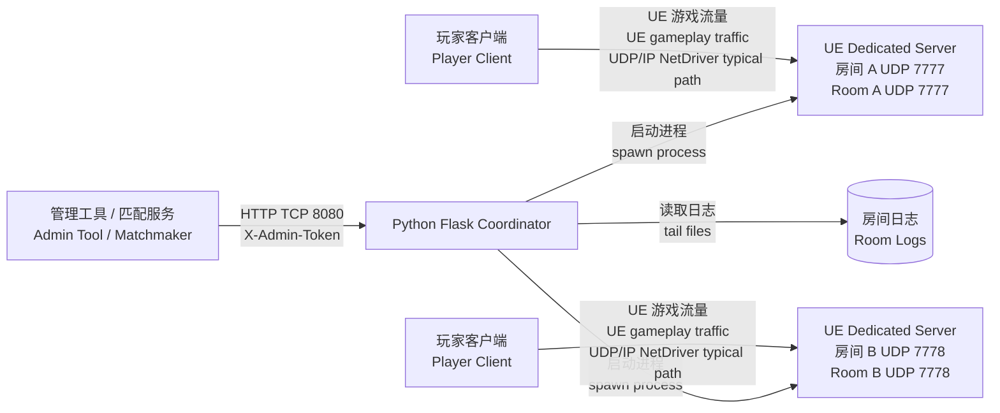

---
title:
  zh: "UE Dedicated Server 部署实践：Docker、WSL/Ubuntu 与 Python Coordinator"
  en: "UE Dedicated Server Deployment Practice: Docker, WSL/Ubuntu, and a Python Coordinator"
description:
  zh: "从 Listen Server 与 Dedicated Server 的边界讲起，用 Docker 运行已经打包好的 Unreal Engine Dedicated Server，并用最小 Python Flask Coordinator 管理房间、端口和日志。"
  en: "A practical walkthrough for running a packaged Unreal Engine Dedicated Server in Docker and coordinating rooms, ports, and logs with a minimal Python Flask service."
pubDate: 2026-05-03
tags:
  - zh: Unreal Engine
    en: Unreal Engine
  - zh: Dedicated Server
    en: Dedicated Server
  - zh: Docker
    en: Docker
  - zh: Python
    en: Python
---

import CodeFold from '../../components/CodeFold.astro';
import LocalizedContent from '../../components/LocalizedContent.astro';

<LocalizedContent language="zh">

<div class="localized-section-heading">

## 系列回顾

<p class="localized-section-heading-en">Series Recap</p>

</div>

</LocalizedContent>

<LocalizedContent language="zh">

上一篇先讲 OnlineSubsystem、Session、Lobby、Travel 与 Replication 的关系：玩家能不能搜到房间、能不能解析连接字符串、能不能跳进正确地图，属于联机服务和入口链路；玩家已经连上后，Actor 状态如何同步，才进入 UE Replication、RPC 和 NetDriver 的主战场。

</LocalizedContent>

<LocalizedContent language="en" class="localized-section-body-en">

The previous article explained how OnlineSubsystem, Session, Lobby, Travel, and Replication fit together. Whether players can discover a room, resolve a connect string, and enter the correct map belongs to the online-service entry path. After the player has connected, Actor state synchronization becomes the job of UE Replication, RPCs, and the NetDriver.

</LocalizedContent>

<LocalizedContent language="zh">

这一篇换一个角度：假设你已经可以打包 Dedicated Server，并且本地能手动启动一个 Server 进程。我们要把它放进一个更接近部署的模型里：Docker 负责运行已经打包好的 Server，Python Coordinator 负责用 HTTP API 创建房间、分配端口、停止进程和读取日志。

</LocalizedContent>

<LocalizedContent language="en" class="localized-section-body-en">

Assume you already have a packaged Dedicated Server and can start it manually. In this deployment model, Docker runs the packaged server, and a Python Coordinator exposes HTTP APIs for creating rooms, assigning ports, stopping processes, and reading logs.

</LocalizedContent>

<LocalizedContent language="zh">

先把边界说清楚：本文代码是教学用的最小实现，不是可以直接暴露到公网的生产平台。真正上线至少还需要更强的鉴权、持久化状态、进程隔离、资源配额、审计日志、指标监控、镜像签名、运行用户降权、故障恢复、区域调度和更完整的安全策略。

</LocalizedContent>

<LocalizedContent language="en" class="localized-section-body-en">

This minimal Coordinator should not be exposed directly to the public internet. A real system needs stronger authentication, persistent state, process isolation, quotas, audit logs, metrics, image signing, non-root runtime users, recovery behavior, regional scheduling, and a wider security model.

</LocalizedContent>

<LocalizedContent language="zh">

<div class="localized-section-heading">

## 本地多人测试为什么不等于服务器部署

<p class="localized-section-heading-en">Why Local Multiplayer Testing Is Not Server Deployment</p>

</div>

</LocalizedContent>

<LocalizedContent language="zh">

编辑器里 PIE 多开、Standalone 两开、`open 127.0.0.1` 或 `?listen` 可以验证很多游戏逻辑，但它们经常把部署问题藏起来：

</LocalizedContent>

<LocalizedContent language="en" class="localized-section-body-en">

PIE multi-instance testing, two Standalone clients, `open 127.0.0.1`, and `?listen` can validate many gameplay behaviors, but they hide deployment concerns:

</LocalizedContent>

<LocalizedContent language="zh">

- 本机回环网络不会暴露云主机安全组、NAT、端口映射和防火墙问题。
- Listen Server 把客户端和服务器权威放在同一个玩家进程里，不等于独立服务器进程。
- 本地日志、崩溃路径、工作目录和资源路径，和容器中的 Linux 运行环境不一定一致。
- 一台机器上只跑一个房间时，通常不会遇到端口池、进程生命周期和日志归档问题。
- 手动启动 Server 可以测试玩法，但无法回答“谁来创建房间、谁来停服、客户端连接哪个端口”。

</LocalizedContent>

<LocalizedContent language="en" class="localized-section-body-en">

- Loopback networking does not test cloud security groups, NAT, port publishing, or firewalls.
- Listen Server puts the client and authority in one player process; that is not a separate server process.
- Local logs, crash paths, working directories, and asset paths may differ from a Linux container.
- A single local room does not test port pools, process lifecycle, or log retention.
- Manual startup does not answer who creates rooms, who stops them, or which port the client should connect to.

</LocalizedContent>

<LocalizedContent language="zh">

本文的最小部署模型是：

</LocalizedContent>

<LocalizedContent language="en" class="localized-section-body-en">

The minimal deployment model is:

</LocalizedContent>

<LocalizedContent language="zh">



</LocalizedContent>

<LocalizedContent language="zh">

这里的 Coordinator 是控制面：它接收 HTTP 请求，用 TCP 8080 暴露 API。UE Dedicated Server 是数据面：玩家通常通过 UE 的 UDP/IP NetDriver 或平台 socket 连接实际房间端口。

</LocalizedContent>

<LocalizedContent language="en" class="localized-section-body-en">

The Coordinator is the control plane. It receives HTTP requests over TCP 8080. The UE Dedicated Server is the data plane. Players connect to the actual room port, typically through UE's UDP/IP NetDriver or a platform socket path.

</LocalizedContent>

<LocalizedContent language="zh">

<div class="localized-section-heading">

## Listen Server 与 Dedicated Server

<p class="localized-section-heading-en">Listen Server and Dedicated Server</p>

</div>

</LocalizedContent>

<LocalizedContent language="zh">

Listen Server 是“一个玩家同时当服务器”。它适合原型、局域网、小规模好友联机和早期功能验证，因为启动链路简单：房主打开地图时带上 `?listen`，其他客户端连接房主地址。

</LocalizedContent>

<LocalizedContent language="en" class="localized-section-body-en">

A Listen Server means one player also acts as the server. It is useful for prototypes, LAN tests, small friend sessions, and early validation because the host opens a map with `?listen` and other clients connect to the host.

</LocalizedContent>

<LocalizedContent language="zh">

Dedicated Server 是没有本地玩家、没有渲染负担的权威服务器进程。它适合更稳定的对战、房间托管、比赛服、自动扩缩容和后台运维。它也会带来额外成本：你需要构建 Server Target，需要在 Linux 或 Windows Server 环境里运行，需要管理端口、日志、进程、崩溃、版本和安全边界。

</LocalizedContent>

<LocalizedContent language="en" class="localized-section-body-en">

A Dedicated Server is an authoritative server process without a local player and without rendering burden. It is more appropriate for stable matches, hosted rooms, competitive servers, automated scaling, and operations. The cost is that you must build a Server Target and manage ports, logs, processes, crashes, versions, and security boundaries.

</LocalizedContent>

<LocalizedContent language="zh">

常见启动命令长这样：

</LocalizedContent>

<LocalizedContent language="en" class="localized-section-body-en">

Common startup:

</LocalizedContent>

<LocalizedContent language="zh">

```bash
./YourProjectServer.sh /Game/Maps/DedicatedEntry -log -port=7777
```

</LocalizedContent>

<LocalizedContent language="en" class="localized-section-body-en">

```bash
./YourProjectServer.sh /Game/Maps/DedicatedEntry -log -port=7777
```

</LocalizedContent>

<LocalizedContent language="zh">

`/Game/Maps/DedicatedEntry` 是服务器启动地图，`-log` 让日志输出更容易排查，`-port=7777` 指定房间监听端口。不同项目还可能加 `-unattended`、`-NoCrashDialog`、`-ini`、`-NetDriverOverrides` 或自定义参数，但不要在没有验证的情况下把它们写成“通用最佳实践”。

</LocalizedContent>

<LocalizedContent language="en" class="localized-section-body-en">

`/Game/Maps/DedicatedEntry` is the server startup map, `-log` helps troubleshooting, and `-port=7777` selects the room port. Other arguments may be useful in a real project, but they should be validated before being treated as general best practice.

</LocalizedContent>

<LocalizedContent language="zh">

<div class="localized-section-heading">

## UE Dedicated Server 构建与启动参数

<p class="localized-section-heading-en">UE Dedicated Server Build and Startup Parameters</p>

</div>

</LocalizedContent>

<LocalizedContent language="zh">

Dedicated Server 的前提是你已经有可运行的 Server 构建产物。UE 项目通常需要一个 Server Target，例如 `YourProjectServer.Target.cs`，再通过 Unreal Build Tool 或 Project Launcher/BuildCookRun 生成 Server 包。

</LocalizedContent>

<LocalizedContent language="en" class="localized-section-body-en">

The prerequisite is a working Server build. UE projects usually need a Server Target such as `YourProjectServer.Target.cs`, then use Unreal Build Tool or Project Launcher / BuildCookRun to produce a packaged server.

</LocalizedContent>

<LocalizedContent language="zh">

本文不展开完整打包流水线，只强调部署侧会依赖这些输入：

</LocalizedContent>

<LocalizedContent language="en" class="localized-section-body-en">

The deployment side needs:

</LocalizedContent>

<LocalizedContent language="zh">

- 一个 Linux 可执行入口，例如 `Server/YourProjectServer.sh`。
- Cook 后的内容和依赖库，且目录结构在容器中保持一致。
- 服务器入口地图，例如 `/Game/Maps/DedicatedEntry`。
- 明确的监听端口，例如 `7777` 到 `7799`。
- 日志输出目录，便于 Coordinator 查询和宿主机收集。

</LocalizedContent>

<LocalizedContent language="en" class="localized-section-body-en">

- A Linux entrypoint, for example `Server/YourProjectServer.sh`.
- Cooked content and dependent libraries with the same directory structure in the container.
- A server entry map such as `/Game/Maps/DedicatedEntry`.
- An explicit port range such as `7777` to `7799`.
- A log directory that the Coordinator and host can read.

</LocalizedContent>

<LocalizedContent language="zh">

教学示例中，一个房间进程的命令由 Python 组装：

</LocalizedContent>

<LocalizedContent language="en" class="localized-section-body-en">

In the example, the process command is assembled as an argument array:

</LocalizedContent>

<LocalizedContent language="zh">

```python
command = [UE_SERVER_EXECUTABLE, map_name, "-log", f"-port={port}"]
```

</LocalizedContent>

<LocalizedContent language="en" class="localized-section-body-en">

```python
command = [UE_SERVER_EXECUTABLE, map_name, "-log", f"-port={port}"]
```

</LocalizedContent>

<LocalizedContent language="zh">

这不是完整进程编排系统，只是把“一个 API 请求创建一个 Server 进程”这件事写清楚。生产环境应补上启动超时、健康探测、崩溃重启策略、资源限制、版本校验和调度约束。

</LocalizedContent>

<LocalizedContent language="en" class="localized-section-body-en">

This is not a full orchestrator. It only shows the core relationship: one API request starts one server process.

</LocalizedContent>

<LocalizedContent language="zh">

<div class="localized-section-heading">

## Ubuntu 与 WSL 环境准备

<p class="localized-section-heading-en">Ubuntu and WSL Environment Setup</p>

</div>

</LocalizedContent>

<LocalizedContent language="zh">

如果你在 Windows 上开发，WSL2 + Ubuntu 是验证 Linux Dedicated Server 和 Docker 镜像的常见路径。基本准备顺序是：

</LocalizedContent>

<LocalizedContent language="en" class="localized-section-body-en">

For Windows development, WSL2 plus Ubuntu is a convenient way to validate Linux server builds and Docker images. A minimal setup flow is:

</LocalizedContent>

<LocalizedContent language="zh">

1. 在 Windows 中启用 WSL2，安装 Ubuntu 发行版。
2. 按 Docker 官方 Ubuntu 文档安装 Docker Engine，或使用 Docker Desktop 的 WSL2 集成。
3. 确认当前用户可以运行 `docker` 和 `docker compose`。
4. 把已经打包好的 Server 目录放到示例约定的位置，例如 `examples/ue-dedicated-server-coordinator/Server`。
5. 确认宿主机防火墙、安全组和路由允许 UDP 7777-7799，以及 Coordinator 管理端口 TCP 8080。

</LocalizedContent>

<LocalizedContent language="en" class="localized-section-body-en">

1. Enable WSL2 and install Ubuntu.
2. Install Docker Engine from the official Ubuntu documentation, or use Docker Desktop with WSL2 integration.
3. Confirm `docker` and `docker compose` work for the current user.
4. Put the packaged Server directory at the example path, such as `examples/ue-dedicated-server-coordinator/Server`.
5. Allow UDP 7777-7799 and TCP 8080 through host firewall, cloud security groups, and routing.

</LocalizedContent>

<LocalizedContent language="zh">

最小验证命令：

</LocalizedContent>

<LocalizedContent language="en" class="localized-section-body-en">

```bash
docker --version
docker compose version
```

</LocalizedContent>

<LocalizedContent language="zh">

```bash
docker --version
docker compose version
```

</LocalizedContent>

<LocalizedContent language="en" class="localized-section-body-en">

If the container starts but the client cannot connect, check UDP port publishing and firewall rules before assuming Replication code is broken.

</LocalizedContent>

<LocalizedContent language="zh">

如果容器启动成功但客户端连不上，优先查 UDP 端口映射、云安全组、防火墙和 Server 日志，而不是先怀疑 Replication 代码。

</LocalizedContent>

<LocalizedContent language="zh">

<div class="localized-section-heading">

## Dockerfile：运行已经打包好的 Server

<p class="localized-section-heading-en">Dockerfile: Running the Packaged Server</p>

</div>

</LocalizedContent>

<LocalizedContent language="zh">

这个 Dockerfile 做的事很少：使用 Ubuntu 基础镜像，把已经打包好的 `Server` 目录复制进镜像，声明 UDP 7777，并用一个固定命令启动 Server。

</LocalizedContent>

<LocalizedContent language="en" class="localized-section-body-en">

This Dockerfile uses Ubuntu, copies the packaged `Server` directory, declares UDP 7777, and starts the server with a fixed command.

</LocalizedContent>

<LocalizedContent language="zh">

```dockerfile
FROM ubuntu:24.04

WORKDIR /opt/ue-server

COPY Server ./Server

EXPOSE 7777/udp

CMD ["./Server/YourProjectServer.sh", "/Game/Maps/DedicatedEntry", "-log", "-port=7777"]
```

</LocalizedContent>

<LocalizedContent language="en" class="localized-section-body-en">

```dockerfile
FROM ubuntu:24.04

WORKDIR /opt/ue-server

COPY Server ./Server

EXPOSE 7777/udp

CMD ["./Server/YourProjectServer.sh", "/Game/Maps/DedicatedEntry", "-log", "-port=7777"]
```

</LocalizedContent>

<LocalizedContent language="zh">

`EXPOSE 7777/udp` 是镜像元数据，不等于宿主机自动开放端口。真正的端口发布要靠 `docker run -p 7777:7777/udp` 或 compose 的 `ports`。如果你的 Server 需要额外系统库、运行用户、证书、时区或崩溃收集器，也应该在镜像里显式处理。

</LocalizedContent>

<LocalizedContent language="en" class="localized-section-body-en">

`EXPOSE 7777/udp` is metadata. It does not publish the host port by itself. Use `docker run -p 7777:7777/udp` or compose `ports` to expose it.

</LocalizedContent>

<LocalizedContent language="zh">

<CodeFold title="Dockerfile" description="完整示例：运行已经打包好的 UE Dedicated Server。">

```dockerfile
FROM ubuntu:24.04

WORKDIR /opt/ue-server

COPY Server ./Server

EXPOSE 7777/udp

CMD ["./Server/YourProjectServer.sh", "/Game/Maps/DedicatedEntry", "-log", "-port=7777"]
```

</CodeFold>

</LocalizedContent>

<LocalizedContent language="en" class="localized-section-body-en">

<CodeFold title="Dockerfile" description="Complete example for running a packaged UE Dedicated Server.">

```dockerfile
FROM ubuntu:24.04

WORKDIR /opt/ue-server

COPY Server ./Server

EXPOSE 7777/udp

CMD ["./Server/YourProjectServer.sh", "/Game/Maps/DedicatedEntry", "-log", "-port=7777"]
```

</CodeFold>

</LocalizedContent>

<LocalizedContent language="zh">

<div class="localized-section-heading">

## docker compose：Coordinator 与端口映射

<p class="localized-section-heading-en">docker compose: Coordinator and Port Publishing</p>

</div>

</LocalizedContent>

<LocalizedContent language="zh">

compose 示例把 Coordinator 放进 `python:3.12-slim` 容器里运行，同时把两个端口范围发布出来：

</LocalizedContent>

<LocalizedContent language="en" class="localized-section-body-en">

The compose example runs the Coordinator in `python:3.12-slim` and publishes:

</LocalizedContent>

<LocalizedContent language="zh">

- `8080:8080/tcp`：Flask Coordinator 的 HTTP 管理 API。
- `7777-7799:7777-7799/udp`：UE Dedicated Server 房间端口池。

</LocalizedContent>

<LocalizedContent language="en" class="localized-section-body-en">

- `8080:8080/tcp`: Flask Coordinator HTTP management API.
- `7777-7799:7777-7799/udp`: UE Dedicated Server room port pool.

</LocalizedContent>

<LocalizedContent language="zh">

这份 compose 使用 Flask development server，并且在容器启动时执行 `pip install`，目的只是让示例容易运行和修改。生产环境应构建固定镜像、固定依赖版本，并使用合适的 WSGI/ASGI 运行方式或内部服务部署方式。

</LocalizedContent>

<LocalizedContent language="en" class="localized-section-body-en">

It uses Flask's development server and installs dependencies during startup so the example stays easy to edit. Production should build a fixed image, pin dependencies, and use an appropriate service runtime.

</LocalizedContent>

<LocalizedContent language="zh">

关键片段如下：

</LocalizedContent>

<LocalizedContent language="en" class="localized-section-body-en">

```yaml
ports:
  - "8080:8080/tcp"
  - "7777-7799:7777-7799/udp"
environment:
  COORDINATOR_ADMIN_TOKEN: ${COORDINATOR_ADMIN_TOKEN:?set COORDINATOR_ADMIN_TOKEN}
  UE_SERVER_EXECUTABLE: /Server/YourProjectServer.sh
  UE_PORT_START: "7777"
  UE_PORT_END: "7799"
```

</LocalizedContent>

<LocalizedContent language="zh">

```yaml
ports:
  - "8080:8080/tcp"
  - "7777-7799:7777-7799/udp"
environment:
  COORDINATOR_ADMIN_TOKEN: ${COORDINATOR_ADMIN_TOKEN:?set COORDINATOR_ADMIN_TOKEN}
  UE_SERVER_EXECUTABLE: /Server/YourProjectServer.sh
  UE_PORT_START: "7777"
  UE_PORT_END: "7799"
```

</LocalizedContent>

<LocalizedContent language="en" class="localized-section-body-en">

`${COORDINATOR_ADMIN_TOKEN:?set COORDINATOR_ADMIN_TOKEN}` makes compose fail when the token is missing. The Python code also fails closed when the token is empty or still `change-me`.

</LocalizedContent>

<LocalizedContent language="zh">

`${COORDINATOR_ADMIN_TOKEN:?set COORDINATOR_ADMIN_TOKEN}` 会让 compose 在变量缺失时失败，Python 代码自己也会再次 fail-closed：如果 `COORDINATOR_ADMIN_TOKEN` 为空或还是 `change-me`，Coordinator 会在启动阶段直接抛错，不会带着弱默认口令继续运行。

</LocalizedContent>

<LocalizedContent language="en" class="localized-section-body-en">

<CodeFold title="docker-compose.yml" description="Complete example with Coordinator, HTTP 8080/tcp, and UE 7777-7799/udp port publishing.">

```yaml
services:
  coordinator:
    image: python:3.12-slim
    working_dir: /app
    command: sh -c "pip install --no-cache-dir -r requirements.txt && flask --app app run --host 0.0.0.0 --port 8080"
    ports:
      - "8080:8080/tcp"
      - "7777-7799:7777-7799/udp"
    environment:
      COORDINATOR_ADMIN_TOKEN: ${COORDINATOR_ADMIN_TOKEN:?set COORDINATOR_ADMIN_TOKEN}
      UE_SERVER_EXECUTABLE: /Server/YourProjectServer.sh
      UE_SERVER_LOG_DIR: /logs
      UE_PORT_START: "7777"
      UE_PORT_END: "7799"
    volumes:
      - ./:/app
      - ./Server:/Server
      - ./logs:/logs
```

</CodeFold>

</LocalizedContent>

<LocalizedContent language="zh">

<CodeFold title="docker-compose.yml" description="完整示例：Coordinator、HTTP 8080/tcp 与 UE 7777-7799/udp 端口映射。">

```yaml
services:
  coordinator:
    image: python:3.12-slim
    working_dir: /app
    command: sh -c "pip install --no-cache-dir -r requirements.txt && flask --app app run --host 0.0.0.0 --port 8080"
    ports:
      - "8080:8080/tcp"
      - "7777-7799:7777-7799/udp"
    environment:
      COORDINATOR_ADMIN_TOKEN: ${COORDINATOR_ADMIN_TOKEN:?set COORDINATOR_ADMIN_TOKEN}
      UE_SERVER_EXECUTABLE: /Server/YourProjectServer.sh
      UE_SERVER_LOG_DIR: /logs
      UE_PORT_START: "7777"
      UE_PORT_END: "7799"
    volumes:
      - ./:/app
      - ./Server:/Server
      - ./logs:/logs
```

</CodeFold>

</LocalizedContent>

<LocalizedContent language="en" class="localized-section-body-en">

```bash
export COORDINATOR_ADMIN_TOKEN="replace-with-a-long-random-value"
docker compose up
```

</LocalizedContent>

<LocalizedContent language="zh">

启动前先设置管理 token：

</LocalizedContent>

<LocalizedContent language="en" class="localized-section-body-en">

```powershell
$env:COORDINATOR_ADMIN_TOKEN = "replace-with-a-long-random-value"
docker compose up
```

</LocalizedContent>

<LocalizedContent language="zh">

```bash
export COORDINATOR_ADMIN_TOKEN="replace-with-a-long-random-value"
docker compose up
```

</LocalizedContent>

<LocalizedContent language="zh">

在 PowerShell 中可以用：

</LocalizedContent>

<LocalizedContent language="zh">

```powershell
$env:COORDINATOR_ADMIN_TOKEN = "replace-with-a-long-random-value"
docker compose up
```

</LocalizedContent>

<LocalizedContent language="zh">

<div class="localized-section-heading">

## Python Coordinator 的职责

<p class="localized-section-heading-en">Responsibilities of the Python Coordinator</p>

</div>

</LocalizedContent>

<LocalizedContent language="zh">

Coordinator 的职责不要膨胀。这个最小版本只做六件事：

</LocalizedContent>

<LocalizedContent language="en" class="localized-section-body-en">

This minimal Coordinator does six things:

</LocalizedContent>

<LocalizedContent language="zh">

- `/health`：无鉴权健康检查，返回 Coordinator 是否还活着以及内存里的房间数量。
- `GET /rooms`：列出房间，要求请求头 `X-Admin-Token`。
- `POST /rooms`：创建房间，分配一个未使用的 UDP 端口，并启动一个 UE Server 进程。
- `GET /rooms/<room_id>`：查看单个房间状态。
- `DELETE /rooms/<room_id>`：停止并删除房间。
- `GET /rooms/<room_id>/logs`：读取房间日志尾部，方便部署排查。

</LocalizedContent>

<LocalizedContent language="en" class="localized-section-body-en">

- `/health`: unauthenticated health check.
- `GET /rooms`: list rooms, requiring `X-Admin-Token`.
- `POST /rooms`: create a room, assign an unused UDP port, and start a UE Server process.
- `GET /rooms/<room_id>`: inspect one room.
- `DELETE /rooms/<room_id>`: stop and delete a room.
- `GET /rooms/<room_id>/logs`: read the tail of the room log.

</LocalizedContent>

<LocalizedContent language="zh">

它有意不做匹配规则、玩家排队、账号系统、租户隔离、数据库、限流、反作弊、跨机调度和区域选择。那些都是生产系统应当设计的部分，但放进第一版教学代码会模糊核心问题。

</LocalizedContent>

<LocalizedContent language="en" class="localized-section-body-en">

It intentionally does not implement matchmaking, player queues, accounts, tenant isolation, databases, rate limits, anti-cheat, cross-machine scheduling, or region selection.

</LocalizedContent>

<LocalizedContent language="zh">

鉴权逻辑是很薄的一层：

</LocalizedContent>

<LocalizedContent language="en" class="localized-section-body-en">

```python
def require_admin_token(route_handler):
    @wraps(route_handler)
    def wrapped(*args, **kwargs):
        if request.headers.get("X-Admin-Token") != ADMIN_TOKEN:
            return jsonify({"error": "unauthorized"}), 401
        return route_handler(*args, **kwargs)

    return wrapped
```

</LocalizedContent>

<LocalizedContent language="zh">

```python
def require_admin_token(route_handler):
    @wraps(route_handler)
    def wrapped(*args, **kwargs):
        if request.headers.get("X-Admin-Token") != ADMIN_TOKEN:
            return jsonify({"error": "unauthorized"}), 401
        return route_handler(*args, **kwargs)

    return wrapped
```

</LocalizedContent>

<LocalizedContent language="en" class="localized-section-body-en">

```python
def allocate_port() -> int | None:
    used_ports = {room.port for room in rooms.values() if room.status == "running"}
    for port in range(UE_PORT_START, UE_PORT_END + 1):
        if port not in used_ports:
            return port
    return None
```

</LocalizedContent>

<LocalizedContent language="zh">

端口分配也只是内存扫描：

</LocalizedContent>

<LocalizedContent language="en" class="localized-section-body-en">

This explains the port-pool model, but it is not enough for multiple Coordinator instances. Multi-instance scheduling needs a database, distributed lock, or dedicated scheduler.

</LocalizedContent>

<LocalizedContent language="zh">

```python
def allocate_port() -> int | None:
    used_ports = {room.port for room in rooms.values() if room.status == "running"}
    for port in range(UE_PORT_START, UE_PORT_END + 1):
        if port not in used_ports:
            return port
    return None
```

</LocalizedContent>

<LocalizedContent language="zh">

这足够讲清楚端口池模型，但不适合多 Coordinator 实例共享。多实例时需要数据库、分布式锁或专门的调度器，否则两个 Coordinator 可能分到同一个端口。

</LocalizedContent>

<LocalizedContent language="zh">

<div class="localized-section-heading">

## Flask App：最小可运行实现

<p class="localized-section-heading-en">Flask App: Minimal Runnable Implementation</p>

</div>

</LocalizedContent>

<LocalizedContent language="zh">

下面的 `app.py` 是完整教学实现。重点看三个位置：

</LocalizedContent>

<LocalizedContent language="en" class="localized-section-body-en">

The full implementation lives in:

</LocalizedContent>

<LocalizedContent language="zh">

- 启动时检查 `COORDINATOR_ADMIN_TOKEN`，为空或 `change-me` 就 fail-closed。
- 创建房间时从 `7777-7799` 找可用 UDP 端口，并用 `subprocess.Popen` 启动 Server。
- 删除房间时向进程组发 SIGTERM，超时后再 SIGKILL。

</LocalizedContent>

<LocalizedContent language="en" class="localized-section-body-en">

- `examples/ue-dedicated-server-coordinator/app.py`
- `examples/ue-dedicated-server-coordinator/Dockerfile`
- `examples/ue-dedicated-server-coordinator/docker-compose.yml`
- `examples/ue-dedicated-server-coordinator/requirements.txt`

</LocalizedContent>

<LocalizedContent language="zh">

创建房间的关键片段：

</LocalizedContent>

<LocalizedContent language="en" class="localized-section-body-en">

The key behavior is:

</LocalizedContent>

<LocalizedContent language="zh">

```python
@app.post("/rooms")
@require_admin_token
def create_room():
    payload = request.get_json(silent=True) or {}
    room_id = str(payload.get("room_id") or uuid.uuid4())
    map_name = str(payload.get("map_name") or DEFAULT_MAP_NAME)

    with state_lock:
        port = allocate_port()
        if port is None:
            return jsonify({"error": "no ports available"}), 503

        room = start_server(room_id, map_name, port)
        return jsonify(room_payload(room)), 201
```

</LocalizedContent>

<LocalizedContent language="en" class="localized-section-body-en">

- Startup checks `COORDINATOR_ADMIN_TOKEN` and fails closed if it is empty or `change-me`.
- Room creation scans `7777-7799` for an available UDP port and starts a server process.
- Room deletion sends SIGTERM to the process group, then SIGKILL after a timeout.

</LocalizedContent>

<LocalizedContent language="zh">

示例请求：

</LocalizedContent>

<LocalizedContent language="en" class="localized-section-body-en">

```python
@app.post("/rooms")
@require_admin_token
def create_room():
    payload = request.get_json(silent=True) or {}
    room_id = str(payload.get("room_id") or uuid.uuid4())
    map_name = str(payload.get("map_name") or DEFAULT_MAP_NAME)

    with state_lock:
        port = allocate_port()
        if port is None:
            return jsonify({"error": "no ports available"}), 503

        room = start_server(room_id, map_name, port)
        return jsonify(room_payload(room)), 201
```

</LocalizedContent>

<LocalizedContent language="zh">

```bash
curl -X POST http://localhost:8080/rooms \
  -H "Content-Type: application/json" \
  -H "X-Admin-Token: replace-with-a-long-random-value" \
  -d '{"room_id":"test-001","map_name":"/Game/Maps/DedicatedEntry"}'
```

</LocalizedContent>

<LocalizedContent language="en" class="localized-section-body-en">

```bash
curl -X POST http://localhost:8080/rooms \
  -H "Content-Type: application/json" \
  -H "X-Admin-Token: replace-with-a-long-random-value" \
  -d '{"room_id":"test-001","map_name":"/Game/Maps/DedicatedEntry"}'
```

</LocalizedContent>

<LocalizedContent language="zh">

<CodeFold title="app.py" description="完整示例：Flask Coordinator、房间 API、端口池、进程管理和日志读取。">

```python
import os
import re
import signal
import subprocess
import threading
import uuid
from dataclasses import asdict, dataclass
from functools import wraps
from pathlib import Path

from flask import Flask, Response, jsonify, request


ADMIN_TOKEN = os.environ.get("COORDINATOR_ADMIN_TOKEN", "")
UE_SERVER_EXECUTABLE = os.environ.get("UE_SERVER_EXECUTABLE", "")
UE_SERVER_LOG_DIR = Path(os.environ.get("UE_SERVER_LOG_DIR", "logs"))
UE_PORT_START = int(os.environ.get("UE_PORT_START", "7777"))
UE_PORT_END = int(os.environ.get("UE_PORT_END", "7799"))
DEFAULT_MAP_NAME = "/Game/Maps/DedicatedEntry"
STOP_TIMEOUT_SECONDS = 10
DEFAULT_LOG_TAIL_BYTES = 64 * 1024
MAX_LOG_TAIL_BYTES = 256 * 1024

app = Flask(__name__)

if not ADMIN_TOKEN or ADMIN_TOKEN == "change-me":
    raise RuntimeError("Set COORDINATOR_ADMIN_TOKEN to a non-placeholder value before starting the coordinator.")


@dataclass
class RoomInstance:
    room_id: str
    map_name: str
    port: int
    pid: int
    log_path: str
    status: str


rooms: dict[str, RoomInstance] = {}
processes: dict[str, subprocess.Popen] = {}
state_lock = threading.Lock()


def require_admin_token(route_handler):
    @wraps(route_handler)
    def wrapped(*args, **kwargs):
        if request.headers.get("X-Admin-Token") != ADMIN_TOKEN:
            return jsonify({"error": "unauthorized"}), 401
        return route_handler(*args, **kwargs)

    return wrapped


def allocate_port() -> int | None:
    used_ports = {room.port for room in rooms.values() if room.status == "running"}
    for port in range(UE_PORT_START, UE_PORT_END + 1):
        if port not in used_ports:
            return port
    return None


def safe_room_id(value: str) -> str:
    return re.sub(r"[^A-Za-z0-9_.-]", "_", value)


def is_safe_room_id(value: str) -> bool:
    return bool(re.fullmatch(r"[A-Za-z0-9_.-]+", value))


def start_server(room_id: str, map_name: str, port: int) -> RoomInstance:
    if not UE_SERVER_EXECUTABLE:
        raise RuntimeError("UE_SERVER_EXECUTABLE is not configured")

    UE_SERVER_LOG_DIR.mkdir(parents=True, exist_ok=True)
    log_path = UE_SERVER_LOG_DIR / f"{safe_room_id(room_id)}.log"
    command = [UE_SERVER_EXECUTABLE, map_name, "-log", f"-port={port}"]

    with log_path.open("ab") as log_file:
        process = subprocess.Popen(
            command,
            stdout=log_file,
            stderr=subprocess.STDOUT,
            start_new_session=(os.name != "nt"),
        )

    room = RoomInstance(
        room_id=room_id,
        map_name=map_name,
        port=port,
        pid=process.pid,
        log_path=str(log_path),
        status="running",
    )
    processes[room_id] = process
    rooms[room_id] = room
    return room


def refresh_room_status(room_id: str) -> RoomInstance | None:
    room = rooms.get(room_id)
    if room is None:
        return None

    process = processes.get(room_id)
    if process is None:
        if room.status == "running":
            room.status = "unknown"
        return room

    exit_code = process.poll()
    if exit_code is None:
        room.status = "running"
    else:
        room.status = f"exited:{exit_code}"
        processes.pop(room_id, None)
    return room


def room_payload(room: RoomInstance):
    return asdict(room)


@app.get("/health")
def health():
    with state_lock:
        room_count = len(rooms)
    return jsonify({"status": "ok", "rooms": room_count})


@app.get("/rooms")
@require_admin_token
def list_rooms():
    with state_lock:
        for room_id in list(rooms):
            refresh_room_status(room_id)
        return jsonify({"rooms": [room_payload(room) for room in rooms.values()]})


@app.post("/rooms")
@require_admin_token
def create_room():
    payload = request.get_json(silent=True) or {}
    room_id = str(payload.get("room_id") or uuid.uuid4())
    map_name = str(payload.get("map_name") or DEFAULT_MAP_NAME)

    if not is_safe_room_id(room_id):
        return jsonify({"error": "room_id may only contain letters, numbers, underscore, dash, and dot"}), 400

    with state_lock:
        if room_id in rooms:
            return jsonify({"error": "room already exists"}), 409

        for existing_room_id in list(rooms):
            refresh_room_status(existing_room_id)

        port = allocate_port()
        if port is None:
            return jsonify({"error": "no ports available"}), 503

        try:
            room = start_server(room_id, map_name, port)
        except Exception as exc:
            rooms.pop(room_id, None)
            processes.pop(room_id, None)
            return jsonify({"error": str(exc)}), 500

        return jsonify(room_payload(room)), 201


@app.get("/rooms/<room_id>")
@require_admin_token
def get_room(room_id):
    with state_lock:
        room = refresh_room_status(room_id)
        if room is None:
            return jsonify({"error": "room not found"}), 404
        return jsonify(room_payload(room))


@app.delete("/rooms/<room_id>")
@require_admin_token
def delete_room(room_id):
    with state_lock:
        room = refresh_room_status(room_id)
        if room is None:
            return jsonify({"error": "room not found"}), 404

        process = processes.pop(room_id, None)
        room.status = "stopping"

    if process is not None and process.poll() is None:
        if os.name == "nt":
            process.terminate()
        else:
            os.killpg(process.pid, signal.SIGTERM)

        try:
            process.wait(timeout=STOP_TIMEOUT_SECONDS)
        except subprocess.TimeoutExpired:
            if os.name == "nt":
                process.kill()
            else:
                os.killpg(process.pid, signal.SIGKILL)
            process.wait(timeout=STOP_TIMEOUT_SECONDS)

    with state_lock:
        room = rooms.pop(room_id, room)
        room.status = "stopped"
        return jsonify(room_payload(room))


@app.get("/rooms/<room_id>/logs")
@require_admin_token
def get_room_logs(room_id):
    try:
        tail_bytes = int(request.args.get("bytes", DEFAULT_LOG_TAIL_BYTES))
    except ValueError:
        return jsonify({"error": "bytes must be an integer"}), 400

    tail_bytes = max(1, min(tail_bytes, MAX_LOG_TAIL_BYTES))

    with state_lock:
        room = rooms.get(room_id)
        if room is None:
            return jsonify({"error": "room not found"}), 404
        log_path = Path(room.log_path)

    if not log_path.exists():
        return Response("", mimetype="text/plain")

    file_size = log_path.stat().st_size
    with log_path.open("rb") as log_file:
        log_file.seek(max(file_size - tail_bytes, 0))
        content = log_file.read(tail_bytes)

    return Response(content, mimetype="text/plain")


if __name__ == "__main__":
    app.run(host="0.0.0.0", port=int(os.environ.get("COORDINATOR_HTTP_PORT", "8080")))
```

</CodeFold>

</LocalizedContent>

<LocalizedContent language="zh">

<div class="localized-section-heading">

## UDP、TCP、Replication 与 RPC

<p class="localized-section-heading-en">UDP, TCP, Replication, and RPC</p>

</div>

</LocalizedContent>

<LocalizedContent language="zh">

这里最容易混淆的是“可靠 RPC”和“TCP”。UE 里的 Reliable RPC 是 UE 网络层的可靠投递语义，不等于底层一定使用 TCP。UE 游戏复制常见路径是 UDP/IP NetDriver 或平台 socket；Coordinator 的 Flask HTTP API 才是典型 TCP 控制面。

</LocalizedContent>

<LocalizedContent language="en" class="localized-section-body-en">

The most common confusion is Reliable RPC versus TCP. UE Reliable RPC is reliable-delivery semantics in UE's networking layer; it does not mean the transport must be TCP. UE gameplay replication commonly uses UDP/IP NetDriver or a platform socket path. The Flask Coordinator HTTP API is the TCP control plane.

</LocalizedContent>

<LocalizedContent language="zh">

| 层级<span class="cell-en">Layer</span> | 常见协议<span class="cell-en">Typical Protocol</span> | 传输内容<span class="cell-en">Carries</span> | 适合用途<span class="cell-en">Should Be Used For</span> | 不要混淆为<span class="cell-en">Should Not Be Confused With</span> |
| --- | --- | --- | --- | --- |
| Coordinator HTTP API | TCP via HTTP | 创建房间、删除房间、查状态、查日志<span class="cell-en">Create room, delete room, inspect state, read logs</span> | 管理面、后台工具、匹配服务调用<span class="cell-en">Control plane, admin tools, matchmaker calls</span> | UE Gameplay Replication |
| UE Gameplay NetDriver | UDP/IP NetDriver 或平台 socket<span class="cell-en">UDP/IP NetDriver or platform socket</span> | Actor Replication、Movement、RPC、连接握手相关数据<span class="cell-en">Actor Replication, Movement, RPC, connection handshake data</span> | 实时游戏状态同步<span class="cell-en">Realtime gameplay synchronization</span> | Flask API、REST、WebSocket |
| UE Reliable RPC | 当前 NetDriver 上的 UE 可靠语义<span class="cell-en">UE reliability semantics over the active NetDriver</span> | 需要可靠到达的 RPC 调用<span class="cell-en">RPC calls that need reliable arrival</span> | 少量关键游戏事件<span class="cell-en">Small critical gameplay events</span> | TCP 连接本身<span class="cell-en">TCP itself</span> |
| UE Unreliable RPC / property replication | UE NetDriver 语义<span class="cell-en">UE NetDriver semantics</span> | 高频、可丢弃或可被新状态覆盖的数据<span class="cell-en">High-frequency, discardable, or overwriteable state</span> | 移动、瞄准、短生命周期状态<span class="cell-en">Movement, aiming, short-lived state</span> | “不重要的数据”<span class="cell-en">“Unimportant data”</span> |
| Docker port publishing | 宿主机 / 容器 NAT 规则<span class="cell-en">Host/container NAT rules</span> | 宿主机端口到容器端口映射<span class="cell-en">Host port to container port mapping</span> | 暴露 8080/tcp 与 7777-7799/udp<span class="cell-en">Expose 8080/tcp and 7777-7799/udp</span> | 应用协议可靠性<span class="cell-en">Application reliability</span> |

</LocalizedContent>

<LocalizedContent language="en" class="localized-section-body-en">

| Layer | Typical Protocol | Carries | Should Be Used For | Should Not Be Confused With |
| --- | --- | --- | --- | --- |
| Coordinator HTTP API | TCP via HTTP | Create room, delete room, inspect state, read logs | Control plane, admin tools, matchmaker calls | UE Gameplay Replication |
| UE Gameplay NetDriver | UDP/IP NetDriver or platform socket | Actor Replication, Movement, RPC, connection handshake data | Realtime gameplay synchronization | Flask API, REST, WebSocket |
| UE Reliable RPC | UE reliability semantics over the active NetDriver | RPC calls that need reliable arrival | Small critical gameplay events | TCP itself |
| UE Unreliable RPC / property replication | UE NetDriver semantics | High-frequency, discardable, or overwriteable state | Movement, aiming, short-lived state | “Unimportant data” |
| Docker port publishing | Host/container NAT rules | Host port to container port mapping | Expose 8080/tcp and 7777-7799/udp | Application reliability |

</LocalizedContent>

<LocalizedContent language="zh">

如果一个客户端连接不上 Dedicated Server，先确认它访问的是房间的 UDP 端口，而不是 Coordinator 的 TCP 8080。`POST /rooms` 返回的 `port` 是给玩家连接 UE Server 用的；`8080` 是给管理工具调用 Coordinator 用的。

</LocalizedContent>

<LocalizedContent language="en" class="localized-section-body-en">

If a client cannot connect, verify that it is connecting to the room's UDP port, not the Coordinator's TCP 8080.

</LocalizedContent>

<LocalizedContent language="zh">

<div class="localized-section-heading">

## 部署排查：端口、日志、Travel 与 NetDriver

<p class="localized-section-heading-en">Deployment Troubleshooting: Ports, Logs, Travel, and NetDriver</p>

</div>

</LocalizedContent>

<LocalizedContent language="zh">

排查 Dedicated Server 部署时，建议按链路从外到内走：

</LocalizedContent>

<LocalizedContent language="en" class="localized-section-body-en">

Debug from the outside inward:

</LocalizedContent>

<LocalizedContent language="zh">

1. 端口是否发布：compose 中要有 `7777-7799:7777-7799/udp`，云主机安全组和系统防火墙也要放行 UDP。
2. Coordinator 是否可访问：`GET /health` 应该走 `8080/tcp`，这只能证明控制面活着，不能证明 UE Server 可连接。
3. Token 是否正确：除 `/health` 外，房间 API 都要求 `X-Admin-Token` 与 `COORDINATOR_ADMIN_TOKEN` 完全一致。
4. Server 是否真的启动：看 `POST /rooms` 返回的 `pid`、`port`、`status`，再查 `/rooms/<room_id>/logs`。
5. 地图是否正确：启动地图、`ServerTravel` 目标地图、客户端 `ClientTravel` 地址要对应，路径错误会表现为连接后掉线或加载失败。
6. NetDriver 是否匹配：项目配置、平台 OnlineSubsystem、Dedicated Server 构建和客户端构建要使用兼容的网络驱动和协议路径。
7. 日志是否足够：教学代码只做日志尾部读取；生产环境应接入集中日志、结构化字段、实例 ID、版本号和区域信息。

</LocalizedContent>

<LocalizedContent language="en" class="localized-section-body-en">

1. Port publishing: compose must include `7777-7799:7777-7799/udp`, and firewalls must allow UDP.
2. Coordinator availability: `/health` on `8080/tcp` only proves the control plane is alive.
3. Token correctness: room APIs require `X-Admin-Token` to match `COORDINATOR_ADMIN_TOKEN`.
4. Server startup: inspect `pid`, `port`, `status`, and `/rooms/<room_id>/logs`.
5. Map correctness: startup map, `ServerTravel`, and `ClientTravel` target must match.
6. NetDriver compatibility: client and server builds must use compatible network drivers and protocol paths.
7. Log quality: production should add centralized logs, structured fields, instance ID, version, and region.

</LocalizedContent>

<LocalizedContent language="zh">

常用请求：

</LocalizedContent>

<LocalizedContent language="en" class="localized-section-body-en">

```bash
curl http://localhost:8080/health

curl http://localhost:8080/rooms \
  -H "X-Admin-Token: replace-with-a-long-random-value"

curl http://localhost:8080/rooms/test-001/logs?bytes=65536 \
  -H "X-Admin-Token: replace-with-a-long-random-value"
```

</LocalizedContent>

<LocalizedContent language="zh">

```bash
curl http://localhost:8080/health

curl http://localhost:8080/rooms \
  -H "X-Admin-Token: replace-with-a-long-random-value"

curl http://localhost:8080/rooms/test-001/logs?bytes=65536 \
  -H "X-Admin-Token: replace-with-a-long-random-value"
```

</LocalizedContent>

<LocalizedContent language="en" class="localized-section-body-en">

UE clients should connect to the actual room address and port:

</LocalizedContent>

<LocalizedContent language="zh">

UE 客户端连接时要使用房间实际地址和端口，例如：

</LocalizedContent>

<LocalizedContent language="en" class="localized-section-body-en">

```text
open 203.0.113.10:7777
```

</LocalizedContent>

<LocalizedContent language="zh">

```text
open 203.0.113.10:7777
```

</LocalizedContent>

<LocalizedContent language="en" class="localized-section-body-en">

If OnlineSubsystem or a backend distributes room addresses, it must return the Dedicated Server's public reachable address and UDP port, not a container-internal address, Coordinator address, or loopback address.

</LocalizedContent>

<LocalizedContent language="zh">

如果你通过 OnlineSubsystem 分发房间地址，也要确保 Session 或后端返回的是 Dedicated Server 的公网可达地址和 UDP 端口，而不是容器内地址、Coordinator 地址或本地回环地址。

</LocalizedContent>

<LocalizedContent language="zh">

<div class="localized-section-heading">

## 不要这么做

<p class="localized-section-heading-en">Do Not Do This</p>

</div>

</LocalizedContent>

<LocalizedContent language="zh">

不要把这份 Coordinator 当成公网生产服务直接部署。它没有数据库，重启后房间状态会丢；它没有多实例锁，横向扩展会导致端口竞争；它没有用户级权限模型，只有一个管理 token；它没有资源配额，恶意调用可以反复创建进程；它没有容器级隔离，每个房间只是同一个容器里启动的子进程；它没有审计日志和指标，出了问题很难追踪。

</LocalizedContent>

<LocalizedContent language="en" class="localized-section-body-en">

Do not deploy this Coordinator directly as a public production service. It has no database, no multi-instance lock, only one admin token, no resource quota, no per-room container isolation, and no audit or metrics pipeline.

</LocalizedContent>

<LocalizedContent language="zh">

也不要把 `X-Admin-Token` 当作完整安全方案。教学里用它是为了说明“控制面 API 不能裸奔”，生产中应至少考虑 TLS、短期凭证、服务间身份、请求签名、最小权限、限流、IP 策略和密钥轮换。

</LocalizedContent>

<LocalizedContent language="en" class="localized-section-body-en">

Do not treat `X-Admin-Token` as a complete security model. It is only a teaching example showing that the control-plane API must not be exposed without authentication. Production should consider TLS, short-lived credentials, service identity, request signing, least privilege, rate limits, IP policy, and secret rotation.

</LocalizedContent>

<LocalizedContent language="zh">

不要把 `map_name` 直接当成任意用户输入。示例代码用参数数组启动进程，避免了 shell 拼接注入，但生产环境仍应做地图白名单和版本校验，避免启动未预期地图或与客户端版本不匹配的地图。

</LocalizedContent>

<LocalizedContent language="en" class="localized-section-body-en">

Do not treat `map_name` as arbitrary trusted input. The example avoids shell-string injection by using an argument array, but production should still use a map whitelist and version validation.

</LocalizedContent>

<LocalizedContent language="zh">

不要把 UE Reliable RPC 说成 TCP。可靠 RPC 是 UE 在当前 NetDriver 上提供的可靠语义；底层常见游戏传输仍然是 UDP/IP NetDriver 或平台网络路径。把这件事说错，会直接误导排查方向。

</LocalizedContent>

<LocalizedContent language="en" class="localized-section-body-en">

Do not say UE Reliable RPC is TCP. Reliable RPC is a UE reliability semantic over the active NetDriver; common gameplay transport is still UDP/IP NetDriver or a platform networking path.

</LocalizedContent>

<LocalizedContent language="zh">

不要只测试本机 `localhost`。部署问题经常只在真实网络路径里出现：容器端口、宿主机防火墙、云安全组、NAT、公网 IP、客户端所在网络和平台 socket 行为都可能影响结果。

</LocalizedContent>

<LocalizedContent language="en" class="localized-section-body-en">

Do not test only `localhost`. Real deployment paths include container ports, host firewall, cloud security groups, NAT, public IP, client network, and platform socket behavior.

</LocalizedContent>

<LocalizedContent language="zh">

<div class="localized-section-heading">

## 参考资料

<p class="localized-section-heading-en">References</p>

</div>

</LocalizedContent>

<LocalizedContent language="zh">

- [Unreal Engine Networking and Multiplayer](https://dev.epicgames.com/documentation/en-us/unreal-engine/networking-and-multiplayer-in-unreal-engine?application_version=5.6)
- [Unreal Engine Setting Up Dedicated Servers](https://dev.epicgames.com/documentation/en-us/unreal-engine/setting-up-dedicated-servers-in-unreal-engine?application_version=5.6)
- [Unreal Engine Remote Procedure Calls](https://dev.epicgames.com/documentation/en-us/unreal-engine/remote-procedure-calls-in-unreal-engine?application_version=5.6)
- [Install Docker Engine on Ubuntu](https://docs.docker.com/engine/install/ubuntu/)
- [Dockerfile reference](https://docs.docker.com/reference/dockerfile/)
- [Docker Compose file reference](https://docs.docker.com/reference/compose-file/)
- [Flask Quickstart](https://flask.palletsprojects.com/en/stable/quickstart/)

</LocalizedContent>

<LocalizedContent language="en" class="localized-section-body-en">

- [Unreal Engine Networking and Multiplayer](https://dev.epicgames.com/documentation/en-us/unreal-engine/networking-and-multiplayer-in-unreal-engine?application_version=5.6)
- [Unreal Engine Setting Up Dedicated Servers](https://dev.epicgames.com/documentation/en-us/unreal-engine/setting-up-dedicated-servers-in-unreal-engine?application_version=5.6)
- [Unreal Engine Remote Procedure Calls](https://dev.epicgames.com/documentation/en-us/unreal-engine/remote-procedure-calls-in-unreal-engine?application_version=5.6)
- [Install Docker Engine on Ubuntu](https://docs.docker.com/engine/install/ubuntu/)
- [Dockerfile reference](https://docs.docker.com/reference/dockerfile/)
- [Docker Compose file reference](https://docs.docker.com/reference/compose-file/)
- [Flask Quickstart](https://flask.palletsprojects.com/en/stable/quickstart/)

</LocalizedContent>
