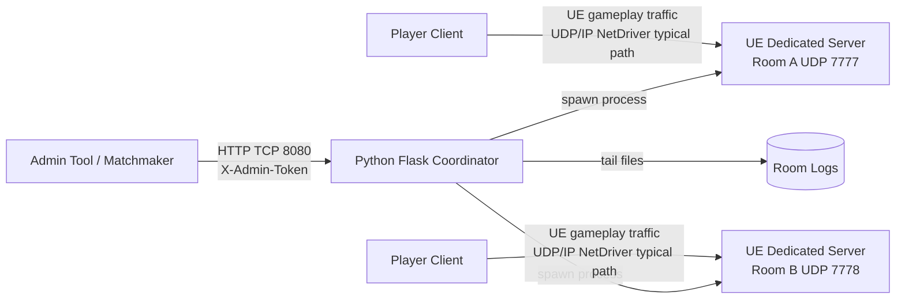

---
title:
  zh: "UE Dedicated Server 部署实践：Docker、WSL/Ubuntu 与 Python Coordinator"
  en: "UE Dedicated Server Deployment Practice: Docker, WSL/Ubuntu, and a Python Coordinator"
description:
  zh: "从 Listen Server 与 Dedicated Server 的边界讲起，用 Docker 运行已经打包好的 Unreal Engine Dedicated Server，并用最小 Python Flask Coordinator 管理房间、端口和日志。"
  en: "A practical walkthrough for running a packaged Unreal Engine Dedicated Server in Docker and coordinating rooms, ports, and logs with a minimal Python Flask service."
pubDate: 2026-05-03
tags:
  - zh: Unreal Engine
    en: Unreal Engine
  - zh: Dedicated Server
    en: Dedicated Server
  - zh: Docker
    en: Docker
  - zh: Python
    en: Python
---

import CodeFold from '../../components/CodeFold.astro';

## 系列回顾

上一篇先讲 OnlineSubsystem、Session、Lobby、Travel 与 Replication 的关系：玩家能不能搜到房间、能不能解析连接字符串、能不能跳进正确地图，属于联机服务和入口链路；玩家已经连上后，Actor 状态如何同步，才进入 UE Replication、RPC 和 NetDriver 的主战场。

这一篇换一个角度：假设你已经可以打包 Dedicated Server，并且本地能手动启动一个 Server 进程。我们要把它放进一个更接近部署的模型里：Docker 负责运行已经打包好的 Server，Python Coordinator 负责用 HTTP API 创建房间、分配端口、停止进程和读取日志。

先把边界说清楚：本文代码是教学用的最小实现，不是可以直接暴露到公网的生产平台。真正上线至少还需要更强的鉴权、持久化状态、进程隔离、资源配额、审计日志、指标监控、镜像签名、运行用户降权、故障恢复、区域调度和更完整的安全策略。

## 本地多人测试为什么不等于服务器部署

编辑器里 PIE 多开、Standalone 两开、`open 127.0.0.1` 或 `?listen` 可以验证很多游戏逻辑，但它们经常把部署问题藏起来：

- 本机回环网络不会暴露云主机安全组、NAT、端口映射和防火墙问题。
- Listen Server 把客户端和服务器权威放在同一个玩家进程里，不等于独立服务器进程。
- 本地日志、崩溃路径、工作目录和资源路径，和容器中的 Linux 运行环境不一定一致。
- 一台机器上只跑一个房间时，通常不会遇到端口池、进程生命周期和日志归档问题。
- 手动启动 Server 可以测试玩法，但无法回答“谁来创建房间、谁来停服、客户端连接哪个端口”。

本文的最小部署模型是：



这里的 Coordinator 是控制面：它接收 HTTP 请求，用 TCP 8080 暴露 API。UE Dedicated Server 是数据面：玩家通常通过 UE 的 UDP/IP NetDriver 或平台 socket 连接实际房间端口。

## Listen Server 与 Dedicated Server

Listen Server 是“一个玩家同时当服务器”。它适合原型、局域网、小规模好友联机和早期功能验证，因为启动链路简单：房主打开地图时带上 `?listen`，其他客户端连接房主地址。

Dedicated Server 是没有本地玩家、没有渲染负担的权威服务器进程。它适合更稳定的对战、房间托管、比赛服、自动扩缩容和后台运维。它也会带来额外成本：你需要构建 Server Target，需要在 Linux 或 Windows Server 环境里运行，需要管理端口、日志、进程、崩溃、版本和安全边界。

常见启动命令长这样：

```bash
./YourProjectServer.sh /Game/Maps/DedicatedEntry -log -port=7777
```

`/Game/Maps/DedicatedEntry` 是服务器启动地图，`-log` 让日志输出更容易排查，`-port=7777` 指定房间监听端口。不同项目还可能加 `-unattended`、`-NoCrashDialog`、`-ini`、`-NetDriverOverrides` 或自定义参数，但不要在没有验证的情况下把它们写成“通用最佳实践”。

## UE Dedicated Server 构建与启动参数

Dedicated Server 的前提是你已经有可运行的 Server 构建产物。UE 项目通常需要一个 Server Target，例如 `YourProjectServer.Target.cs`，再通过 Unreal Build Tool 或 Project Launcher/BuildCookRun 生成 Server 包。

本文不展开完整打包流水线，只强调部署侧会依赖这些输入：

- 一个 Linux 可执行入口，例如 `Server/YourProjectServer.sh`。
- Cook 后的内容和依赖库，且目录结构在容器中保持一致。
- 服务器入口地图，例如 `/Game/Maps/DedicatedEntry`。
- 明确的监听端口，例如 `7777` 到 `7799`。
- 日志输出目录，便于 Coordinator 查询和宿主机收集。

教学示例中，一个房间进程的命令由 Python 组装：

```python
command = [UE_SERVER_EXECUTABLE, map_name, "-log", f"-port={port}"]
```

这不是完整进程编排系统，只是把“一个 API 请求创建一个 Server 进程”这件事写清楚。生产环境应补上启动超时、健康探测、崩溃重启策略、资源限制、版本校验和调度约束。

## Ubuntu 与 WSL 环境准备

如果你在 Windows 上开发，WSL2 + Ubuntu 是验证 Linux Dedicated Server 和 Docker 镜像的常见路径。基本准备顺序是：

1. 在 Windows 中启用 WSL2，安装 Ubuntu 发行版。
2. 按 Docker 官方 Ubuntu 文档安装 Docker Engine，或使用 Docker Desktop 的 WSL2 集成。
3. 确认当前用户可以运行 `docker` 和 `docker compose`。
4. 把已经打包好的 Server 目录放到示例约定的位置，例如 `examples/ue-dedicated-server-coordinator/Server`。
5. 确认宿主机防火墙、安全组和路由允许 UDP 7777-7799，以及 Coordinator 管理端口 TCP 8080。

最小验证命令：

```bash
docker --version
docker compose version
```

如果容器启动成功但客户端连不上，优先查 UDP 端口映射、云安全组、防火墙和 Server 日志，而不是先怀疑 Replication 代码。

## Dockerfile：运行已经打包好的 Server

这个 Dockerfile 做的事很少：使用 Ubuntu 基础镜像，把已经打包好的 `Server` 目录复制进镜像，声明 UDP 7777，并用一个固定命令启动 Server。

```dockerfile
FROM ubuntu:24.04

WORKDIR /opt/ue-server

COPY Server ./Server

EXPOSE 7777/udp

CMD ["./Server/YourProjectServer.sh", "/Game/Maps/DedicatedEntry", "-log", "-port=7777"]
```

`EXPOSE 7777/udp` 是镜像元数据，不等于宿主机自动开放端口。真正的端口发布要靠 `docker run -p 7777:7777/udp` 或 compose 的 `ports`。如果你的 Server 需要额外系统库、运行用户、证书、时区或崩溃收集器，也应该在镜像里显式处理。

<CodeFold title="Dockerfile" description="完整示例：运行已经打包好的 UE Dedicated Server。">

```dockerfile
FROM ubuntu:24.04

WORKDIR /opt/ue-server

COPY Server ./Server

EXPOSE 7777/udp

CMD ["./Server/YourProjectServer.sh", "/Game/Maps/DedicatedEntry", "-log", "-port=7777"]
```

</CodeFold>

## docker compose：Coordinator 与端口映射

compose 示例把 Coordinator 放进 `python:3.12-slim` 容器里运行，同时把两个端口范围发布出来：

- `8080:8080/tcp`：Flask Coordinator 的 HTTP 管理 API。
- `7777-7799:7777-7799/udp`：UE Dedicated Server 房间端口池。

这份 compose 使用 Flask development server，并且在容器启动时执行 `pip install`，目的只是让示例容易运行和修改。生产环境应构建固定镜像、固定依赖版本，并使用合适的 WSGI/ASGI 运行方式或内部服务部署方式。

关键片段如下：

```yaml
ports:
  - "8080:8080/tcp"
  - "7777-7799:7777-7799/udp"
environment:
  COORDINATOR_ADMIN_TOKEN: ${COORDINATOR_ADMIN_TOKEN:?set COORDINATOR_ADMIN_TOKEN}
  UE_SERVER_EXECUTABLE: /Server/YourProjectServer.sh
  UE_PORT_START: "7777"
  UE_PORT_END: "7799"
```

`${COORDINATOR_ADMIN_TOKEN:?set COORDINATOR_ADMIN_TOKEN}` 会让 compose 在变量缺失时失败，Python 代码自己也会再次 fail-closed：如果 `COORDINATOR_ADMIN_TOKEN` 为空或还是 `change-me`，Coordinator 会在启动阶段直接抛错，不会带着弱默认口令继续运行。

<CodeFold title="docker-compose.yml" description="完整示例：Coordinator、HTTP 8080/tcp 与 UE 7777-7799/udp 端口映射。">

```yaml
services:
  coordinator:
    image: python:3.12-slim
    working_dir: /app
    command: sh -c "pip install --no-cache-dir -r requirements.txt && flask --app app run --host 0.0.0.0 --port 8080"
    ports:
      - "8080:8080/tcp"
      - "7777-7799:7777-7799/udp"
    environment:
      COORDINATOR_ADMIN_TOKEN: ${COORDINATOR_ADMIN_TOKEN:?set COORDINATOR_ADMIN_TOKEN}
      UE_SERVER_EXECUTABLE: /Server/YourProjectServer.sh
      UE_SERVER_LOG_DIR: /logs
      UE_PORT_START: "7777"
      UE_PORT_END: "7799"
    volumes:
      - ./:/app
      - ./Server:/Server
      - ./logs:/logs
```

</CodeFold>

启动前先设置管理 token：

```bash
export COORDINATOR_ADMIN_TOKEN="replace-with-a-long-random-value"
docker compose up
```

在 PowerShell 中可以用：

```powershell
$env:COORDINATOR_ADMIN_TOKEN = "replace-with-a-long-random-value"
docker compose up
```

## Python Coordinator 的职责

Coordinator 的职责不要膨胀。这个最小版本只做六件事：

- `/health`：无鉴权健康检查，返回 Coordinator 是否还活着以及内存里的房间数量。
- `GET /rooms`：列出房间，要求请求头 `X-Admin-Token`。
- `POST /rooms`：创建房间，分配一个未使用的 UDP 端口，并启动一个 UE Server 进程。
- `GET /rooms/<room_id>`：查看单个房间状态。
- `DELETE /rooms/<room_id>`：停止并删除房间。
- `GET /rooms/<room_id>/logs`：读取房间日志尾部，方便部署排查。

它有意不做匹配规则、玩家排队、账号系统、租户隔离、数据库、限流、反作弊、跨机调度和区域选择。那些都是生产系统应当设计的部分，但放进第一版教学代码会模糊核心问题。

鉴权逻辑是很薄的一层：

```python
def require_admin_token(route_handler):
    @wraps(route_handler)
    def wrapped(*args, **kwargs):
        if request.headers.get("X-Admin-Token") != ADMIN_TOKEN:
            return jsonify({"error": "unauthorized"}), 401
        return route_handler(*args, **kwargs)

    return wrapped
```

端口分配也只是内存扫描：

```python
def allocate_port() -> int | None:
    used_ports = {room.port for room in rooms.values() if room.status == "running"}
    for port in range(UE_PORT_START, UE_PORT_END + 1):
        if port not in used_ports:
            return port
    return None
```

这足够讲清楚端口池模型，但不适合多 Coordinator 实例共享。多实例时需要数据库、分布式锁或专门的调度器，否则两个 Coordinator 可能分到同一个端口。

## Flask App：最小可运行实现

下面的 `app.py` 是完整教学实现。重点看三个位置：

- 启动时检查 `COORDINATOR_ADMIN_TOKEN`，为空或 `change-me` 就 fail-closed。
- 创建房间时从 `7777-7799` 找可用 UDP 端口，并用 `subprocess.Popen` 启动 Server。
- 删除房间时向进程组发 SIGTERM，超时后再 SIGKILL。

创建房间的关键片段：

```python
@app.post("/rooms")
@require_admin_token
def create_room():
    payload = request.get_json(silent=True) or {}
    room_id = str(payload.get("room_id") or uuid.uuid4())
    map_name = str(payload.get("map_name") or DEFAULT_MAP_NAME)

    with state_lock:
        port = allocate_port()
        if port is None:
            return jsonify({"error": "no ports available"}), 503

        room = start_server(room_id, map_name, port)
        return jsonify(room_payload(room)), 201
```

示例请求：

```bash
curl -X POST http://localhost:8080/rooms \
  -H "Content-Type: application/json" \
  -H "X-Admin-Token: replace-with-a-long-random-value" \
  -d '{"room_id":"test-001","map_name":"/Game/Maps/DedicatedEntry"}'
```

<CodeFold title="app.py" description="完整示例：Flask Coordinator、房间 API、端口池、进程管理和日志读取。">

```python
import os
import re
import signal
import subprocess
import threading
import uuid
from dataclasses import asdict, dataclass
from functools import wraps
from pathlib import Path

from flask import Flask, Response, jsonify, request


ADMIN_TOKEN = os.environ.get("COORDINATOR_ADMIN_TOKEN", "")
UE_SERVER_EXECUTABLE = os.environ.get("UE_SERVER_EXECUTABLE", "")
UE_SERVER_LOG_DIR = Path(os.environ.get("UE_SERVER_LOG_DIR", "logs"))
UE_PORT_START = int(os.environ.get("UE_PORT_START", "7777"))
UE_PORT_END = int(os.environ.get("UE_PORT_END", "7799"))
DEFAULT_MAP_NAME = "/Game/Maps/DedicatedEntry"
STOP_TIMEOUT_SECONDS = 10
DEFAULT_LOG_TAIL_BYTES = 64 * 1024
MAX_LOG_TAIL_BYTES = 256 * 1024

app = Flask(__name__)

if not ADMIN_TOKEN or ADMIN_TOKEN == "change-me":
    raise RuntimeError("Set COORDINATOR_ADMIN_TOKEN to a non-placeholder value before starting the coordinator.")


@dataclass
class RoomInstance:
    room_id: str
    map_name: str
    port: int
    pid: int
    log_path: str
    status: str


rooms: dict[str, RoomInstance] = {}
processes: dict[str, subprocess.Popen] = {}
state_lock = threading.Lock()


def require_admin_token(route_handler):
    @wraps(route_handler)
    def wrapped(*args, **kwargs):
        if request.headers.get("X-Admin-Token") != ADMIN_TOKEN:
            return jsonify({"error": "unauthorized"}), 401
        return route_handler(*args, **kwargs)

    return wrapped


def allocate_port() -> int | None:
    used_ports = {room.port for room in rooms.values() if room.status == "running"}
    for port in range(UE_PORT_START, UE_PORT_END + 1):
        if port not in used_ports:
            return port
    return None


def safe_room_id(value: str) -> str:
    return re.sub(r"[^A-Za-z0-9_.-]", "_", value)


def is_safe_room_id(value: str) -> bool:
    return bool(re.fullmatch(r"[A-Za-z0-9_.-]+", value))


def start_server(room_id: str, map_name: str, port: int) -> RoomInstance:
    if not UE_SERVER_EXECUTABLE:
        raise RuntimeError("UE_SERVER_EXECUTABLE is not configured")

    UE_SERVER_LOG_DIR.mkdir(parents=True, exist_ok=True)
    log_path = UE_SERVER_LOG_DIR / f"{safe_room_id(room_id)}.log"
    command = [UE_SERVER_EXECUTABLE, map_name, "-log", f"-port={port}"]

    with log_path.open("ab") as log_file:
        process = subprocess.Popen(
            command,
            stdout=log_file,
            stderr=subprocess.STDOUT,
            start_new_session=(os.name != "nt"),
        )

    room = RoomInstance(
        room_id=room_id,
        map_name=map_name,
        port=port,
        pid=process.pid,
        log_path=str(log_path),
        status="running",
    )
    processes[room_id] = process
    rooms[room_id] = room
    return room


def refresh_room_status(room_id: str) -> RoomInstance | None:
    room = rooms.get(room_id)
    if room is None:
        return None

    process = processes.get(room_id)
    if process is None:
        if room.status == "running":
            room.status = "unknown"
        return room

    exit_code = process.poll()
    if exit_code is None:
        room.status = "running"
    else:
        room.status = f"exited:{exit_code}"
        processes.pop(room_id, None)
    return room


def room_payload(room: RoomInstance):
    return asdict(room)


@app.get("/health")
def health():
    with state_lock:
        room_count = len(rooms)
    return jsonify({"status": "ok", "rooms": room_count})


@app.get("/rooms")
@require_admin_token
def list_rooms():
    with state_lock:
        for room_id in list(rooms):
            refresh_room_status(room_id)
        return jsonify({"rooms": [room_payload(room) for room in rooms.values()]})


@app.post("/rooms")
@require_admin_token
def create_room():
    payload = request.get_json(silent=True) or {}
    room_id = str(payload.get("room_id") or uuid.uuid4())
    map_name = str(payload.get("map_name") or DEFAULT_MAP_NAME)

    if not is_safe_room_id(room_id):
        return jsonify({"error": "room_id may only contain letters, numbers, underscore, dash, and dot"}), 400

    with state_lock:
        if room_id in rooms:
            return jsonify({"error": "room already exists"}), 409

        for existing_room_id in list(rooms):
            refresh_room_status(existing_room_id)

        port = allocate_port()
        if port is None:
            return jsonify({"error": "no ports available"}), 503

        try:
            room = start_server(room_id, map_name, port)
        except Exception as exc:
            rooms.pop(room_id, None)
            processes.pop(room_id, None)
            return jsonify({"error": str(exc)}), 500

        return jsonify(room_payload(room)), 201


@app.get("/rooms/<room_id>")
@require_admin_token
def get_room(room_id):
    with state_lock:
        room = refresh_room_status(room_id)
        if room is None:
            return jsonify({"error": "room not found"}), 404
        return jsonify(room_payload(room))


@app.delete("/rooms/<room_id>")
@require_admin_token
def delete_room(room_id):
    with state_lock:
        room = refresh_room_status(room_id)
        if room is None:
            return jsonify({"error": "room not found"}), 404

        process = processes.pop(room_id, None)
        room.status = "stopping"

    if process is not None and process.poll() is None:
        if os.name == "nt":
            process.terminate()
        else:
            os.killpg(process.pid, signal.SIGTERM)

        try:
            process.wait(timeout=STOP_TIMEOUT_SECONDS)
        except subprocess.TimeoutExpired:
            if os.name == "nt":
                process.kill()
            else:
                os.killpg(process.pid, signal.SIGKILL)
            process.wait(timeout=STOP_TIMEOUT_SECONDS)

    with state_lock:
        room = rooms.pop(room_id, room)
        room.status = "stopped"
        return jsonify(room_payload(room))


@app.get("/rooms/<room_id>/logs")
@require_admin_token
def get_room_logs(room_id):
    try:
        tail_bytes = int(request.args.get("bytes", DEFAULT_LOG_TAIL_BYTES))
    except ValueError:
        return jsonify({"error": "bytes must be an integer"}), 400

    tail_bytes = max(1, min(tail_bytes, MAX_LOG_TAIL_BYTES))

    with state_lock:
        room = rooms.get(room_id)
        if room is None:
            return jsonify({"error": "room not found"}), 404
        log_path = Path(room.log_path)

    if not log_path.exists():
        return Response("", mimetype="text/plain")

    file_size = log_path.stat().st_size
    with log_path.open("rb") as log_file:
        log_file.seek(max(file_size - tail_bytes, 0))
        content = log_file.read(tail_bytes)

    return Response(content, mimetype="text/plain")


if __name__ == "__main__":
    app.run(host="0.0.0.0", port=int(os.environ.get("COORDINATOR_HTTP_PORT", "8080")))
```

</CodeFold>

## UDP、TCP、Replication 与 RPC

这里最容易混淆的是“可靠 RPC”和“TCP”。UE 里的 Reliable RPC 是 UE 网络层的可靠投递语义，不等于底层一定使用 TCP。UE 游戏复制常见路径是 UDP/IP NetDriver 或平台 socket；Coordinator 的 Flask HTTP API 才是典型 TCP 控制面。

| Layer | Typical Protocol | Carries | Should Be Used For | Should Not Be Confused With |
| --- | --- | --- | --- | --- |
| Coordinator HTTP API | TCP via HTTP | 创建房间、删除房间、查状态、查日志 | 管理面、后台工具、匹配服务调用 | UE Gameplay Replication |
| UE Gameplay NetDriver | UDP/IP NetDriver 或平台 socket | Actor Replication、Movement、RPC、连接握手相关数据 | 实时游戏状态同步 | Flask API、REST、WebSocket |
| UE Reliable RPC | UE reliability semantics over the active NetDriver | 需要可靠到达的 RPC 调用 | 少量关键游戏事件 | TCP 连接本身 |
| UE Unreliable RPC / property replication | UE NetDriver semantics | 高频、可丢弃或可被新状态覆盖的数据 | 移动、瞄准、短生命周期状态 | “不重要的数据” |
| Docker port publishing | Host/container NAT rules | 宿主机端口到容器端口映射 | 暴露 8080/tcp 与 7777-7799/udp | 应用协议可靠性 |

如果一个客户端连接不上 Dedicated Server，先确认它访问的是房间的 UDP 端口，而不是 Coordinator 的 TCP 8080。`POST /rooms` 返回的 `port` 是给玩家连接 UE Server 用的；`8080` 是给管理工具调用 Coordinator 用的。

## 部署排查：端口、日志、Travel 与 NetDriver

排查 Dedicated Server 部署时，建议按链路从外到内走：

1. 端口是否发布：compose 中要有 `7777-7799:7777-7799/udp`，云主机安全组和系统防火墙也要放行 UDP。
2. Coordinator 是否可访问：`GET /health` 应该走 `8080/tcp`，这只能证明控制面活着，不能证明 UE Server 可连接。
3. Token 是否正确：除 `/health` 外，房间 API 都要求 `X-Admin-Token` 与 `COORDINATOR_ADMIN_TOKEN` 完全一致。
4. Server 是否真的启动：看 `POST /rooms` 返回的 `pid`、`port`、`status`，再查 `/rooms/<room_id>/logs`。
5. 地图是否正确：启动地图、`ServerTravel` 目标地图、客户端 `ClientTravel` 地址要对应，路径错误会表现为连接后掉线或加载失败。
6. NetDriver 是否匹配：项目配置、平台 OnlineSubsystem、Dedicated Server 构建和客户端构建要使用兼容的网络驱动和协议路径。
7. 日志是否足够：教学代码只做日志尾部读取；生产环境应接入集中日志、结构化字段、实例 ID、版本号和区域信息。

常用请求：

```bash
curl http://localhost:8080/health

curl http://localhost:8080/rooms \
  -H "X-Admin-Token: replace-with-a-long-random-value"

curl http://localhost:8080/rooms/test-001/logs?bytes=65536 \
  -H "X-Admin-Token: replace-with-a-long-random-value"
```

UE 客户端连接时要使用房间实际地址和端口，例如：

```text
open 203.0.113.10:7777
```

如果你通过 OnlineSubsystem 分发房间地址，也要确保 Session 或后端返回的是 Dedicated Server 的公网可达地址和 UDP 端口，而不是容器内地址、Coordinator 地址或本地回环地址。

## 不要这么做

不要把这份 Coordinator 当成公网生产服务直接部署。它没有数据库，重启后房间状态会丢；它没有多实例锁，横向扩展会导致端口竞争；它没有用户级权限模型，只有一个管理 token；它没有资源配额，恶意调用可以反复创建进程；它没有容器级隔离，每个房间只是同一个容器里启动的子进程；它没有审计日志和指标，出了问题很难追踪。

也不要把 `X-Admin-Token` 当作完整安全方案。教学里用它是为了说明“控制面 API 不能裸奔”，生产中应至少考虑 TLS、短期凭证、服务间身份、请求签名、最小权限、限流、IP 策略和密钥轮换。

不要把 `map_name` 直接当成任意用户输入。示例代码用参数数组启动进程，避免了 shell 拼接注入，但生产环境仍应做地图白名单和版本校验，避免启动未预期地图或与客户端版本不匹配的地图。

不要把 UE Reliable RPC 说成 TCP。可靠 RPC 是 UE 在当前 NetDriver 上提供的可靠语义；底层常见游戏传输仍然是 UDP/IP NetDriver 或平台网络路径。把这件事说错，会直接误导排查方向。

不要只测试本机 `localhost`。部署问题经常只在真实网络路径里出现：容器端口、宿主机防火墙、云安全组、NAT、公网 IP、客户端所在网络和平台 socket 行为都可能影响结果。

## 参考资料

- [Unreal Engine Networking and Multiplayer](https://dev.epicgames.com/documentation/en-us/unreal-engine/networking-and-multiplayer-in-unreal-engine?application_version=5.6)
- [Unreal Engine Setting Up Dedicated Servers](https://dev.epicgames.com/documentation/en-us/unreal-engine/setting-up-dedicated-servers-in-unreal-engine?application_version=5.6)
- [Unreal Engine Remote Procedure Calls](https://dev.epicgames.com/documentation/en-us/unreal-engine/remote-procedure-calls-in-unreal-engine?application_version=5.6)
- [Install Docker Engine on Ubuntu](https://docs.docker.com/engine/install/ubuntu/)
- [Dockerfile reference](https://docs.docker.com/reference/dockerfile/)
- [Docker Compose file reference](https://docs.docker.com/reference/compose-file/)
- [Flask Quickstart](https://flask.palletsprojects.com/en/stable/quickstart/)
