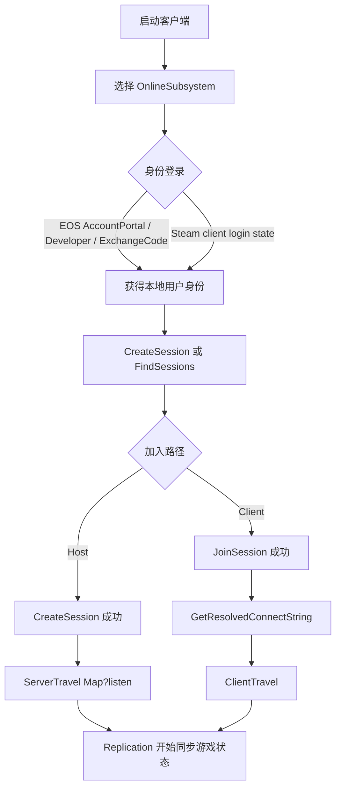

---
title:
  zh: "UE OnlineSubsystem 多人联机实践：Steam、EOS 与会话系统完整拆解"
  en: "UE OnlineSubsystem Multiplayer Practice: Steam, EOS, and Sessions"
description:
  zh: "以 EOS 为主线、Steam 为对照，拆解 Unreal Engine OnlineSubsystem、登录、Session、Lobby 与常见搜房失败问题。"
  en: "An EOS-heavy tutorial and review of Unreal Engine OnlineSubsystem, login, sessions, lobbies, and Steam comparison."
pubDate: 2026-05-03
tags:
  - zh: Unreal Engine
    en: Unreal Engine
  - zh: OnlineSubsystem
    en: OnlineSubsystem
  - zh: EOS
    en: EOS
  - zh: Steam
    en: Steam
---

import CodeFold from '../../components/CodeFold.astro';

## 系列定位

这篇是 UE 多人联机系列的第一篇，目标不是把 EOS 或 Steam 的所有面板选项列成手册，而是把「一个 UE 项目从登录、建房、搜房、加入到地图跳转」这条链路讲清楚。

文章风格会偏教程 + 复盘：先建立模型，再给配置和代码，最后讲排错。主线会更偏 EOS，因为 EOS 的产品设置、Artifact、身份登录和跨平台语义更容易暴露概念边界；Steam 会作为对照，用来说明同一套 OnlineSubsystem 接口在不同后端上并不会得到完全相同的行为。

需要先声明边界：这里不会声称我已经在 2026-05-03 逐项复测了所有组合。EOS Product Settings 是我记忆中的实践背景；AccountPortal、Developer、ExchangeCode 是常见的官方登录路径，但每个项目仍需要用自己的 Epic Developer Portal 项目、Artifact、Client Policy、Deployment 和构建环境验证。

## 为什么 UE 联机不只是 Replication

很多 UE 联机入门会先接触 Replication：`UPROPERTY(Replicated)`、RPC、`GameMode`、`PlayerState`、`Actor` 同步、`ServerTravel`。这些确实是游戏运行时同步的核心，但它们只回答「玩家已经连上某个服务器以后，游戏状态如何同步」。

真正上线前，还会遇到另一组问题：

- 玩家如何登录平台身份？
- 房间如何被发现？
- 谁负责好友邀请、加入中、Presence、NAT 穿透？
- 测试服、正式服、不同区域部署如何区分？
- 为什么主机 `CreateSession` 成功了，客户端 `FindSessions` 仍然是空？

这些问题不属于 Replication 本身，而属于在线服务层。UE 的 OnlineSubsystem 试图为这些在线服务提供统一接口，但它不是「行为统一器」。它统一的是调用入口和接口形状，不保证 EOS、Steam、Null、平台主机网络在搜索过滤、Lobby 语义、身份凭证、邀请链路上表现完全一致。

一个更准确的心智模型是：



## 三层模型：复制、在线服务与业务后端

UE 多人游戏通常可以拆成三层。

| 层级 | 负责什么 | 常见 UE / 服务组件 | 不负责什么 |
| --- | --- | --- | --- |
| 复制层 | Actor 状态同步、RPC、地图跳转后的游戏逻辑 | Replication、NetDriver、GameMode、PlayerState | 平台账号、商店、排行榜、长期账号数据 |
| 在线服务层 | 登录、Session / Lobby、好友、邀请、Presence、P2P 中继或 NAT 相关能力 | OnlineSubsystem、EOS、Steam | 权威游戏逻辑、战斗结算、反作弊完整策略 |
| 业务后端层 | 账号绑定、库存、匹配规则、赛季、支付校验、运营数据 | 自建后端、PlayFab、GameLift、Epic/Steam Web API 等 | UE 内部对象复制 |

EOS 和 Steam 都不是完整游戏服务器。它们可以提供身份、会话发现、Lobby、P2P、中继、好友、成就、商店等平台能力，但它们不会替你运行权威的 `GameMode`，也不会自动实现你的匹配规则、角色库存或赛季结算。你可以用 Listen Server 快速联机，也可以用 Dedicated Server 做更稳定的权威服务；这和选择 EOS / Steam 不是同一个维度。

## OnlineSubsystem 的核心接口

OnlineSubsystem 的价值在于把平台差异收进一组接口里。常见链路至少会碰到：

| 接口 | 常用职责 | 注意点 |
| --- | --- | --- |
| `IOnlineIdentity` | 登录、登出、用户 ID、账号信息 | 登录凭证类型强烈依赖具体 Subsystem。`AccountPortal` 是 EOS 登录流，不是 Steam 登录流。 |
| `IOnlineSession` | 创建、销毁、查找、加入 Session | `FOnlineSessionSettings` 的标志位需要和搜索条件、后端能力同时匹配。 |
| `IOnlineFriends` | 好友列表、邀请辅助 | 不同平台的好友关系来源不同，跨平台好友通常需要额外设计。 |
| `IOnlineExternalUI` | 打开平台登录或邀请 UI | 可用性取决于平台、构建目标和运行环境。 |
| `IOnlinePresence` | Presence 状态 | Presence 不是房间发现的万能开关，只是会话可见性的一个相关维度。 |

典型的初始化代码并不复杂，复杂的是失败时要知道失败在哪一层：

```cpp
IOnlineSubsystem* OnlineSubsystem = IOnlineSubsystem::Get();
IOnlineSessionPtr SessionInterface = OnlineSubsystem ? OnlineSubsystem->GetSessionInterface() : nullptr;
IOnlineIdentityPtr IdentityInterface = OnlineSubsystem ? OnlineSubsystem->GetIdentityInterface() : nullptr;

if (!OnlineSubsystem || !SessionInterface.IsValid() || !IdentityInterface.IsValid())
{
    UE_LOG(LogTemp, Error, TEXT("Online subsystem is not ready."));
}
```

这段代码只说明接口拿到了，不说明 EOS Portal 配置正确，也不说明 Steam 客户端登录状态可用，更不说明房间一定能被搜到。

## EOS 产品设置：字段、UE 配置与错误症状

EOS 的麻烦点通常不在代码第一行，而在 Developer Portal 的产品、Sandbox、Deployment、Client、Artifact 和 UE 配置是否完全对应。下面这张表是排查时最值得反复对照的部分。

| Portal field | UE config | 影响什么 | 常见失败症状 |
| --- | --- | --- | --- |
| Product ID | `ProductId` | 指向哪个 EOS Product | 初始化失败，日志提示 EOS SDK 配置无效或产品不匹配 |
| Sandbox ID | `SandboxId` | 指向开发、测试或生产沙盒 | 登录成功但 Session / Lobby 不互通，不同客户端像在不同环境 |
| Deployment ID | `DeploymentId` | 指向具体部署环境 | Session 创建成功但另一端搜不到，或统计、成就、Lobby 资源隔离 |
| Client ID | `ClientId` | 客户端认证身份 | 登录请求失败，Auth / Connect 返回 credentials 或 policy 相关错误 |
| Client Secret | `ClientSecret` | 客户端密钥，常见于桌面开发配置 | 初始化或登录阶段失败；注意不要提交真实密钥到公开仓库 |
| Artifact Name | `DefaultArtifactName` 与 `Artifacts=(ArtifactName=...)` | UE 选择哪组 EOS 参数 | PIE、Development、Shipping 使用了错误 Artifact，表现为环境错乱 |
| Client Policy | Portal 中的 Client Policy | 允许哪些 EOS API 操作 | 登录能过，但 Session、Lobby、Presence、Friends 等接口被拒绝 |
| Encryption Key | `EncryptionKey` | 部分 EOS 数据加密配置 | SDK 初始化或服务访问失败，错误看起来不像 C++ 逻辑问题 |

一个用于说明字段位置的 `DefaultEngine.ini` 片段如下。真实项目中不要把真实 `ClientSecret`、密钥和产品 ID 直接公开。

```ini
[OnlineSubsystem]
DefaultPlatformService=EOS

[OnlineSubsystemEOS]
bEnabled=true

[/Script/OnlineSubsystemEOS.EOSSettings]
CacheDir=CacheDir
DefaultArtifactName=DevArtifact
bUseEAS=true
bUseEOSConnect=true
bMirrorStatsToEOS=false
bMirrorAchievementsToEOS=false
bUseEOSSessions=true

+Artifacts=(ArtifactName="DevArtifact",ClientId="EOS_CLIENT_ID",ClientSecret="EOS_CLIENT_SECRET",ProductId="EOS_PRODUCT_ID",SandboxId="EOS_SANDBOX_ID",DeploymentId="EOS_DEPLOYMENT_ID",EncryptionKey="EOS_ENCRYPTION_KEY")
```

我的排查顺序一般是：先确认 UE 实际加载了 EOS Subsystem，再确认 Artifact 名称命中，再确认登录凭证类型，再确认 Client Policy 是否允许 Session / Lobby / Presence，最后才去怀疑 `FindSessions` 的代码。

## EOS 登录：AccountPortal、Developer 与 ExchangeCode

EOS 登录要先区分 Auth 和 Connect 的目标。UE 项目里常见写法是通过 `IOnlineIdentity::Login` 传入 `FOnlineAccountCredentials`，再由 OnlineSubsystemEOS 把凭证映射到 EOS SDK 的登录路径。这里最常见的三类是：

| 登录方式 | 典型用途 | 凭证含义 | 注意点 |
| --- | --- | --- | --- |
| `AccountPortal` | 桌面开发、让玩家打开 Epic 账号网页登录 | `Type=AccountPortal`，`Id` / `Token` 常为空 | EOS 特定路径，会打开账号 Portal；不适用于 Steam 登录语义 |
| `Developer` | 本地开发者认证工具 | `Id` 通常是 Dev Auth Tool 地址或上下文，`Token` 是账号名 | 适合开发环境；需要本机工具、端口和账号上下文正确 |
| `ExchangeCode` | Epic Games Launcher 启动游戏后交换登录码 | `Token` 来自 Launcher 提供的 exchange code | 常用于通过 Epic 启动的发行链路，必须验证启动参数和部署配置 |

示例项目里的登录函数只实现了 `AccountPortal`，并且主动拒绝非 EOS Subsystem：

```cpp
FOnlineAccountCredentials Credentials;
Credentials.Type = TEXT("AccountPortal");
Credentials.Id = FString();
Credentials.Token = FString();

IdentityInterface->Login(0, Credentials);
```

这个判断很重要：Steam 通常依赖 Steam 客户端登录状态和 Steam OnlineSubsystem 初始化，不应该把 EOS 的 `AccountPortal` 当成通用登录按钮。

## Session 与 Lobby 的边界

在 UE 里，Session 更像「一局可加入游戏的发现记录和连接信息」。Lobby 更像「进入游戏前的房间状态容器」，可以承载成员、元数据、邀请和准备状态。实际项目会混用这两个词，但排错时必须拆开。

| 对比项 | Session | Lobby |
| --- | --- | --- |
| 核心目的 | 让玩家发现并加入一局游戏 | 让玩家在开局前聚集、聊天、准备、同步房间元数据 |
| UE 常用接口 | `IOnlineSession`、`CreateSession`、`FindSessions`、`JoinSession` | EOS Lobby Interface、Steam Lobby / Matchmaking，或 OSS 中 `bUseLobbiesIfAvailable` 的封装 |
| 连接关系 | 最终要解析连接字符串并 `ClientTravel` | 不一定立刻进入地图，可以先停留在房间 UI |
| 数据同步 | 适合少量搜索条件和广告字段 | 更适合成员级状态、房主、房间属性变更 |
| 平台差异 | OSS 提供统一入口，但搜索行为差异明显 | EOS Lobby 和 Steam Lobby 的限制、回调、成员数据都不同 |

代码上常见的桥接点是 `bUseLobbiesIfAvailable`。它不是魔法开关，只表示在后端支持时优先使用 Lobby 实现 Session 语义；如果创建侧设置了 Lobby / Presence，搜索侧也常常需要用对应 QuerySettings 去找。

```cpp
FOnlineSessionSettings SessionSettings;
SessionSettings.bIsLANMatch = false;
SessionSettings.NumPublicConnections = 4;
SessionSettings.bShouldAdvertise = true;
SessionSettings.bAllowJoinInProgress = true;
SessionSettings.bAllowJoinViaPresence = true;
SessionSettings.bUsesPresence = true;
SessionSettings.bUseLobbiesIfAvailable = true;
SessionSettings.Set(TEXT("MAPNAME"), FString(TEXT("ThirdPersonMap")), EOnlineDataAdvertisementType::ViaOnlineServiceAndPing);
SessionSettings.Set(TEXT("BUILDID"), FString(TEXT("dev")), EOnlineDataAdvertisementType::ViaOnlineServiceAndPing);
```

## Steam 作为对照：AppID、Spacewar 与 Lobby

Steam 的入口更偏平台客户端：本机要运行 Steam 客户端，游戏要能拿到 AppID，Steam API 初始化成功后，OnlineSubsystemSteam 才有意义。

开发阶段经常看到 `SteamDevAppId=480` 或 `steam_appid.txt` 写 `480`。这是 Valve 提供的 Spacewar 示例 AppID，适合开发测试和 SDK 示例，不是你的正式游戏 AppID，也不应该把它当作线上发行配置。

```ini
[OnlineSubsystem]
DefaultPlatformService=Steam

[OnlineSubsystemSteam]
bEnabled=true
SteamDevAppId=480
bRelaunchInSteam=false
bUseSteamNetworking=true
```

Steam Lobby 更像 Steam Matchmaking / Lobby API 的自然模型，适合小队、房间元数据、好友加入和邀请。UE 的 `IOnlineSession` 可以屏蔽一部分接入细节，但不会把 Steam Lobby 的所有行为变成 EOS Lobby 行为，也不会把 EOS 的账号 Portal 变成 Steam 登录。

因此做跨平台或多平台抽象时，建议把自己的上层接口写成「登录」「创建房间」「搜索房间」「加入房间」「离开房间」这些业务动作，而不是把某一个平台的概念直接泄漏到 UI 和 Gameplay 代码里。

## 完整 C++ 会话链路

下面这份 `UOnlineSessionManager` 是一个教学用的最小闭环：初始化 OnlineSubsystem，EOS AccountPortal 登录，创建 Session，搜索 Session，加入 Session，解析连接字符串并跳转地图。它刻意保留了状态机和错误层级，方便定位问题到底出在 Identity、Session、Travel、Platform 还是 Deployment。

```cpp
SessionSearch = MakeShared<FOnlineSessionSearch>();
SessionSearch->MaxSearchResults = 50;
SessionSearch->bIsLanQuery = false;
SessionSearch->QuerySettings.Set(SEARCH_PRESENCE, true, EOnlineComparisonOp::Equals);
#if defined(SEARCH_LOBBIES)
SessionSearch->QuerySettings.Set(SEARCH_LOBBIES, true, EOnlineComparisonOp::Equals);
#endif

SessionInterface->FindSessions(0, SessionSearch.ToSharedRef());
```

加入成功后，不要自己猜 IP。先让 Session Interface 解析连接字符串，再交给本地 `PlayerController` 旅行。

```cpp
FString ConnectString;
if (SessionInterface->GetResolvedConnectString(NAME_GameSession, ConnectString) && !ConnectString.IsEmpty())
{
    APlayerController* PlayerController = GetWorld()->GetFirstPlayerController();
    PlayerController->ClientTravel(ConnectString, TRAVEL_Absolute);
}
```

<CodeFold title="OnlineSessionManager.h" description="完整头文件：状态机、错误分层、蓝图入口和 OnlineSubsystem 句柄。">

```cpp
#pragma once

#include "CoreMinimal.h"
#include "Interfaces/OnlineIdentityInterface.h"
#include "Interfaces/OnlineSessionInterface.h"
#include "UObject/Object.h"
#include "OnlineSessionManager.generated.h"

class IOnlineSubsystem;

UENUM(BlueprintType)
enum class EOnlineFlowState : uint8
{
	Idle,
	LoggingIn,
	LoggedIn,
	CreatingSession,
	SessionCreated,
	Searching,
	Joining,
	Connecting,
	InGame,
	DestroyingSession,
	Failed
};

UENUM(BlueprintType)
enum class ENetworkErrorLayer : uint8
{
	Identity,
	Session,
	Travel,
	Server,
	Platform,
	Deployment
};

USTRUCT(BlueprintType)
struct FRoomConfig
{
	GENERATED_BODY()

	UPROPERTY(EditAnywhere, BlueprintReadWrite, Category = "Online")
	int32 PublicConnections = 4;

	UPROPERTY(EditAnywhere, BlueprintReadWrite, Category = "Online")
	FName MapName = TEXT("ThirdPersonMap");

	UPROPERTY(EditAnywhere, BlueprintReadWrite, Category = "Online")
	FString BuildId = TEXT("dev");
};

USTRUCT(BlueprintType)
struct FOnlineErrorRecord
{
	GENERATED_BODY()

	UPROPERTY(VisibleAnywhere, BlueprintReadOnly, Category = "Online")
	ENetworkErrorLayer Layer = ENetworkErrorLayer::Platform;

	UPROPERTY(VisibleAnywhere, BlueprintReadOnly, Category = "Online")
	FString Operation;

	UPROPERTY(VisibleAnywhere, BlueprintReadOnly, Category = "Online")
	FString Message;

	UPROPERTY(VisibleAnywhere, BlueprintReadOnly, Category = "Online")
	FString PlatformName;
};

UCLASS(BlueprintType)
class UOnlineSessionManager : public UObject
{
	GENERATED_BODY()

public:
	UFUNCTION(BlueprintCallable, Category = "Online")
	bool Initialize();

	UFUNCTION(BlueprintCallable, Category = "Online")
	bool LoginWithAccountPortal();

	UFUNCTION(BlueprintCallable, Category = "Online")
	bool CreateRoom(const FRoomConfig& Config);

	UFUNCTION(BlueprintCallable, Category = "Online")
	bool SearchRooms();

	UFUNCTION(BlueprintCallable, Category = "Online")
	bool JoinRoom(int32 SearchResultIndex);

	UFUNCTION(BlueprintCallable, Category = "Online")
	void DestroyRoom();

	UPROPERTY(VisibleAnywhere, BlueprintReadOnly, Category = "Online")
	EOnlineFlowState FlowState = EOnlineFlowState::Idle;

	UPROPERTY(VisibleAnywhere, BlueprintReadOnly, Category = "Online")
	FOnlineErrorRecord LastError;

	virtual void BeginDestroy() override;

private:
	void SetFailure(ENetworkErrorLayer Layer, const FString& Operation, const FString& Message);
	bool EnsureInitialized(const FString& Operation);
	bool EnsureWorld(const FString& Operation);
	bool IsBusy() const;
	FString GetPlatformName() const;
	FString BuildTravelMapUrl() const;

	void BindLoginDelegate();
	void ClearLoginDelegate();
	void BindCreateSessionDelegate();
	void ClearCreateSessionDelegate();
	void BindFindSessionsDelegate();
	void ClearFindSessionsDelegate();
	void BindJoinSessionDelegate();
	void ClearJoinSessionDelegate();
	void BindDestroySessionDelegate();
	void ClearDestroySessionDelegate();
	void ClearAllDelegates();

	void OnLoginComplete(int32 LocalUserNum, bool bWasSuccessful, const FUniqueNetId& UserId, const FString& Error);
	void OnCreateSessionComplete(FName SessionName, bool bWasSuccessful);
	void OnFindSessionsComplete(bool bWasSuccessful);
	void OnJoinSessionComplete(FName SessionName, EOnJoinSessionCompleteResult::Type Result);
	void OnDestroySessionComplete(FName SessionName, bool bWasSuccessful);

	IOnlineSubsystem* OnlineSubsystem = nullptr;
	IOnlineSessionPtr SessionInterface;
	IOnlineIdentityPtr IdentityInterface;
	TSharedPtr<FOnlineSessionSearch> SessionSearch;
	TArray<FOnlineSessionSearchResult> SearchResults;
	FRoomConfig PendingRoomConfig;

	FDelegateHandle LoginCompleteHandle;
	FDelegateHandle CreateSessionCompleteHandle;
	FDelegateHandle FindSessionsCompleteHandle;
	FDelegateHandle JoinSessionCompleteHandle;
	FDelegateHandle DestroySessionCompleteHandle;
};
```

</CodeFold>

<CodeFold title="OnlineSessionManager.cpp" description="完整源文件：登录、创建、搜索、加入、销毁和地图跳转。">

```cpp
#include "OnlineSessionManager.h"

#include "Engine/Engine.h"
#include "Engine/World.h"
#include "GameFramework/PlayerController.h"
#include "OnlineSubsystem.h"
#include "OnlineSessionSettings.h"

namespace
{
	const FName GameSessionName = NAME_GameSession;
	const FName SettingMapName(TEXT("MAPNAME"));
	const FName SettingBuildId(TEXT("BUILDID"));
}

bool UOnlineSessionManager::Initialize()
{
	OnlineSubsystem = IOnlineSubsystem::Get();
	if (!OnlineSubsystem)
	{
		SetFailure(ENetworkErrorLayer::Platform, TEXT("Initialize"), TEXT("No OnlineSubsystem is loaded."));
		return false;
	}

	SessionInterface = OnlineSubsystem->GetSessionInterface();
	IdentityInterface = OnlineSubsystem->GetIdentityInterface();

	if (!SessionInterface.IsValid())
	{
		SetFailure(ENetworkErrorLayer::Session, TEXT("Initialize"), TEXT("OnlineSubsystem has no session interface."));
		return false;
	}

	if (!IdentityInterface.IsValid())
	{
		SetFailure(ENetworkErrorLayer::Identity, TEXT("Initialize"), TEXT("OnlineSubsystem has no identity interface."));
		return false;
	}

	FlowState = EOnlineFlowState::Idle;
	LastError = FOnlineErrorRecord();
	UE_LOG(LogTemp, Log, TEXT("OnlineSessionManager initialized with platform '%s'."), *GetPlatformName());
	return true;
}

void UOnlineSessionManager::BeginDestroy()
{
	ClearAllDelegates();
	Super::BeginDestroy();
}

bool UOnlineSessionManager::LoginWithAccountPortal()
{
	if (!EnsureInitialized(TEXT("LoginWithAccountPortal")))
	{
		return false;
	}

	if (OnlineSubsystem->GetSubsystemName() != TEXT("EOS"))
	{
		SetFailure(ENetworkErrorLayer::Identity, TEXT("LoginWithAccountPortal"), TEXT("AccountPortal is an EOS login flow. Steam normally uses the Steam client login state instead."));
		return false;
	}

	if (IsBusy())
	{
		SetFailure(ENetworkErrorLayer::Identity, TEXT("LoginWithAccountPortal"), TEXT("Cannot start login while another online operation is running."));
		return false;
	}

	BindLoginDelegate();

	FOnlineAccountCredentials Credentials;
	Credentials.Type = TEXT("AccountPortal");
	Credentials.Id = FString();
	Credentials.Token = FString();

	FlowState = EOnlineFlowState::LoggingIn;
	if (!IdentityInterface->Login(0, Credentials))
	{
		ClearLoginDelegate();
		SetFailure(ENetworkErrorLayer::Identity, TEXT("LoginWithAccountPortal"), TEXT("Login request was rejected by the identity interface."));
		return false;
	}

	return true;
}

bool UOnlineSessionManager::CreateRoom(const FRoomConfig& Config)
{
	if (!EnsureInitialized(TEXT("CreateRoom")))
	{
		return false;
	}

	if (!EnsureWorld(TEXT("CreateRoom")))
	{
		return false;
	}

	const TSharedPtr<const FUniqueNetId> UserId = IdentityInterface->GetUniquePlayerId(0);
	if (!UserId.IsValid())
	{
		SetFailure(ENetworkErrorLayer::Identity, TEXT("CreateRoom"), TEXT("A logged-in local user is required before CreateRoom."));
		return false;
	}

	if (FlowState == EOnlineFlowState::Idle)
	{
		FlowState = EOnlineFlowState::LoggedIn;
	}

	if (FlowState != EOnlineFlowState::LoggedIn)
	{
		SetFailure(ENetworkErrorLayer::Session, TEXT("CreateRoom"), TEXT("CreateRoom requires LoggedIn state."));
		return false;
	}

	if (Config.PublicConnections <= 0)
	{
		SetFailure(ENetworkErrorLayer::Session, TEXT("CreateRoom"), TEXT("PublicConnections must be greater than zero."));
		return false;
	}

	PendingRoomConfig = Config;

	if (SessionInterface->GetNamedSession(GameSessionName))
	{
		UE_LOG(LogTemp, Warning, TEXT("Existing session found. Destroy it before creating a new room."));
		DestroyRoom();
		return false;
	}

	FOnlineSessionSettings SessionSettings;
	SessionSettings.bIsLANMatch = false;
	SessionSettings.NumPublicConnections = Config.PublicConnections;
	SessionSettings.bShouldAdvertise = true;
	SessionSettings.bAllowJoinInProgress = true;
	SessionSettings.bAllowJoinViaPresence = true;
	SessionSettings.bUsesPresence = true;
	SessionSettings.bUseLobbiesIfAvailable = true;
	SessionSettings.bAllowInvites = true;
	SessionSettings.Set(SettingMapName, Config.MapName.ToString(), EOnlineDataAdvertisementType::ViaOnlineServiceAndPing);
	SessionSettings.Set(SettingBuildId, Config.BuildId, EOnlineDataAdvertisementType::ViaOnlineServiceAndPing);

	BindCreateSessionDelegate();
	FlowState = EOnlineFlowState::CreatingSession;

	const bool bCreateStarted = SessionInterface->CreateSession(*UserId, GameSessionName, SessionSettings);

	if (!bCreateStarted)
	{
		ClearCreateSessionDelegate();
		SetFailure(ENetworkErrorLayer::Session, TEXT("CreateRoom"), TEXT("CreateSession returned false."));
		return false;
	}

	return true;
}

bool UOnlineSessionManager::SearchRooms()
{
	if (!EnsureInitialized(TEXT("SearchRooms")))
	{
		return false;
	}

	if (IsBusy())
	{
		SetFailure(ENetworkErrorLayer::Session, TEXT("SearchRooms"), TEXT("Cannot search while another online operation is running."));
		return false;
	}

	SessionSearch = MakeShared<FOnlineSessionSearch>();
	SessionSearch->MaxSearchResults = 50;
	SessionSearch->bIsLanQuery = false;
	SessionSearch->QuerySettings.Set(SEARCH_PRESENCE, true, EOnlineComparisonOp::Equals);
#if defined(SEARCH_LOBBIES)
	SessionSearch->QuerySettings.Set(SEARCH_LOBBIES, true, EOnlineComparisonOp::Equals);
#endif

	BindFindSessionsDelegate();
	FlowState = EOnlineFlowState::Searching;
	SearchResults.Reset();

	if (!SessionInterface->FindSessions(0, SessionSearch.ToSharedRef()))
	{
		ClearFindSessionsDelegate();
		SetFailure(ENetworkErrorLayer::Session, TEXT("SearchRooms"), TEXT("FindSessions returned false."));
		return false;
	}

	return true;
}

bool UOnlineSessionManager::JoinRoom(int32 SearchResultIndex)
{
	if (!EnsureInitialized(TEXT("JoinRoom")))
	{
		return false;
	}

	if (!SearchResults.IsValidIndex(SearchResultIndex))
	{
		SetFailure(ENetworkErrorLayer::Session, TEXT("JoinRoom"), TEXT("Search result index is invalid."));
		return false;
	}

	if (!EnsureWorld(TEXT("JoinRoom")))
	{
		return false;
	}

	BindJoinSessionDelegate();
	FlowState = EOnlineFlowState::Joining;

	if (!SessionInterface->JoinSession(0, GameSessionName, SearchResults[SearchResultIndex]))
	{
		ClearJoinSessionDelegate();
		SetFailure(ENetworkErrorLayer::Session, TEXT("JoinRoom"), TEXT("JoinSession returned false."));
		return false;
	}

	return true;
}

void UOnlineSessionManager::DestroyRoom()
{
	if (!EnsureInitialized(TEXT("DestroyRoom")))
	{
		return;
	}

	if (IsBusy() && FlowState != EOnlineFlowState::DestroyingSession)
	{
		SetFailure(ENetworkErrorLayer::Session, TEXT("DestroyRoom"), TEXT("Cannot destroy a room while another online operation is running."));
		return;
	}

	if (FlowState == EOnlineFlowState::DestroyingSession)
	{
		UE_LOG(LogTemp, Warning, TEXT("DestroyRoom ignored because a destroy operation is already running."));
		return;
	}

	if (!SessionInterface->GetNamedSession(GameSessionName))
	{
		FlowState = IdentityInterface->GetUniquePlayerId(0).IsValid() ? EOnlineFlowState::LoggedIn : EOnlineFlowState::Idle;
		UE_LOG(LogTemp, Warning, TEXT("DestroyRoom called with no active session."));
		return;
	}

	BindDestroySessionDelegate();
	FlowState = EOnlineFlowState::DestroyingSession;
	if (!SessionInterface->DestroySession(GameSessionName))
	{
		ClearDestroySessionDelegate();
		SetFailure(ENetworkErrorLayer::Session, TEXT("DestroyRoom"), TEXT("DestroySession returned false."));
	}
}

void UOnlineSessionManager::SetFailure(ENetworkErrorLayer Layer, const FString& Operation, const FString& Message)
{
	LastError.Layer = Layer;
	LastError.Operation = Operation;
	LastError.Message = Message;
	LastError.PlatformName = GetPlatformName();
	FlowState = EOnlineFlowState::Failed;

	UE_LOG(LogTemp, Error, TEXT("[%s] %s failed: %s"), *LastError.PlatformName, *Operation, *Message);
}

bool UOnlineSessionManager::EnsureInitialized(const FString& Operation)
{
	if (OnlineSubsystem && SessionInterface.IsValid() && IdentityInterface.IsValid())
	{
		return true;
	}

	return Initialize();
}

bool UOnlineSessionManager::EnsureWorld(const FString& Operation)
{
	if (GetWorld())
	{
		return true;
	}

	SetFailure(ENetworkErrorLayer::Travel, Operation, TEXT("UObject has no valid UWorld."));
	return false;
}

bool UOnlineSessionManager::IsBusy() const
{
	return FlowState == EOnlineFlowState::LoggingIn
		|| FlowState == EOnlineFlowState::CreatingSession
		|| FlowState == EOnlineFlowState::Searching
		|| FlowState == EOnlineFlowState::Joining
		|| FlowState == EOnlineFlowState::Connecting
		|| FlowState == EOnlineFlowState::DestroyingSession;
}

FString UOnlineSessionManager::GetPlatformName() const
{
	return OnlineSubsystem ? OnlineSubsystem->GetSubsystemName().ToString() : TEXT("None");
}

FString UOnlineSessionManager::BuildTravelMapUrl() const
{
	const FString Map = PendingRoomConfig.MapName.IsNone()
		? FString(TEXT("ThirdPersonMap"))
		: PendingRoomConfig.MapName.ToString();

	return FString::Printf(TEXT("%s?listen"), *Map);
}

void UOnlineSessionManager::BindLoginDelegate()
{
	ClearLoginDelegate();
	LoginCompleteHandle = IdentityInterface->AddOnLoginCompleteDelegate_Handle(
		0,
		FOnLoginCompleteDelegate::CreateUObject(this, &UOnlineSessionManager::OnLoginComplete));
}

void UOnlineSessionManager::ClearLoginDelegate()
{
	if (IdentityInterface.IsValid() && LoginCompleteHandle.IsValid())
	{
		IdentityInterface->ClearOnLoginCompleteDelegate_Handle(0, LoginCompleteHandle);
	}
	LoginCompleteHandle.Reset();
}

void UOnlineSessionManager::BindCreateSessionDelegate()
{
	ClearCreateSessionDelegate();
	CreateSessionCompleteHandle = SessionInterface->AddOnCreateSessionCompleteDelegate_Handle(
		FOnCreateSessionCompleteDelegate::CreateUObject(this, &UOnlineSessionManager::OnCreateSessionComplete));
}

void UOnlineSessionManager::ClearCreateSessionDelegate()
{
	if (SessionInterface.IsValid() && CreateSessionCompleteHandle.IsValid())
	{
		SessionInterface->ClearOnCreateSessionCompleteDelegate_Handle(CreateSessionCompleteHandle);
	}
	CreateSessionCompleteHandle.Reset();
}

void UOnlineSessionManager::BindFindSessionsDelegate()
{
	ClearFindSessionsDelegate();
	FindSessionsCompleteHandle = SessionInterface->AddOnFindSessionsCompleteDelegate_Handle(
		FOnFindSessionsCompleteDelegate::CreateUObject(this, &UOnlineSessionManager::OnFindSessionsComplete));
}

void UOnlineSessionManager::ClearFindSessionsDelegate()
{
	if (SessionInterface.IsValid() && FindSessionsCompleteHandle.IsValid())
	{
		SessionInterface->ClearOnFindSessionsCompleteDelegate_Handle(FindSessionsCompleteHandle);
	}
	FindSessionsCompleteHandle.Reset();
}

void UOnlineSessionManager::BindJoinSessionDelegate()
{
	ClearJoinSessionDelegate();
	JoinSessionCompleteHandle = SessionInterface->AddOnJoinSessionCompleteDelegate_Handle(
		FOnJoinSessionCompleteDelegate::CreateUObject(this, &UOnlineSessionManager::OnJoinSessionComplete));
}

void UOnlineSessionManager::ClearJoinSessionDelegate()
{
	if (SessionInterface.IsValid() && JoinSessionCompleteHandle.IsValid())
	{
		SessionInterface->ClearOnJoinSessionCompleteDelegate_Handle(JoinSessionCompleteHandle);
	}
	JoinSessionCompleteHandle.Reset();
}

void UOnlineSessionManager::BindDestroySessionDelegate()
{
	ClearDestroySessionDelegate();
	DestroySessionCompleteHandle = SessionInterface->AddOnDestroySessionCompleteDelegate_Handle(
		FOnDestroySessionCompleteDelegate::CreateUObject(this, &UOnlineSessionManager::OnDestroySessionComplete));
}

void UOnlineSessionManager::ClearDestroySessionDelegate()
{
	if (SessionInterface.IsValid() && DestroySessionCompleteHandle.IsValid())
	{
		SessionInterface->ClearOnDestroySessionCompleteDelegate_Handle(DestroySessionCompleteHandle);
	}
	DestroySessionCompleteHandle.Reset();
}

void UOnlineSessionManager::ClearAllDelegates()
{
	ClearLoginDelegate();
	ClearCreateSessionDelegate();
	ClearFindSessionsDelegate();
	ClearJoinSessionDelegate();
	ClearDestroySessionDelegate();
}

void UOnlineSessionManager::OnLoginComplete(int32 LocalUserNum, bool bWasSuccessful, const FUniqueNetId& UserId, const FString& Error)
{
	ClearLoginDelegate();

	if (!bWasSuccessful)
	{
		SetFailure(ENetworkErrorLayer::Identity, TEXT("OnLoginComplete"), Error.IsEmpty() ? TEXT("AccountPortal login failed.") : Error);
		return;
	}

	FlowState = EOnlineFlowState::LoggedIn;
	UE_LOG(LogTemp, Log, TEXT("[%s] Login complete for user %d: %s"), *GetPlatformName(), LocalUserNum, *UserId.ToDebugString());
}

void UOnlineSessionManager::OnCreateSessionComplete(FName SessionName, bool bWasSuccessful)
{
	if (SessionName != GameSessionName)
	{
		UE_LOG(LogTemp, Warning, TEXT("Ignoring create callback for unexpected session '%s'."), *SessionName.ToString());
		return;
	}

	ClearCreateSessionDelegate();

	if (!bWasSuccessful)
	{
		SetFailure(ENetworkErrorLayer::Session, TEXT("OnCreateSessionComplete"), TEXT("CreateSession completed unsuccessfully."));
		return;
	}

	UWorld* World = GetWorld();
	if (!World)
	{
		SetFailure(ENetworkErrorLayer::Travel, TEXT("OnCreateSessionComplete"), TEXT("Cannot ServerTravel because UWorld is null."));
		return;
	}

	FlowState = EOnlineFlowState::SessionCreated;
	const FString TravelUrl = BuildTravelMapUrl();
	UE_LOG(LogTemp, Log, TEXT("[%s] Session created. ServerTravel to %s."), *GetPlatformName(), *TravelUrl);
	World->ServerTravel(TravelUrl);
	FlowState = EOnlineFlowState::InGame;
}

void UOnlineSessionManager::OnFindSessionsComplete(bool bWasSuccessful)
{
	ClearFindSessionsDelegate();

	if (!bWasSuccessful || !SessionSearch.IsValid())
	{
		SetFailure(ENetworkErrorLayer::Session, TEXT("OnFindSessionsComplete"), TEXT("FindSessions completed unsuccessfully."));
		return;
	}

	SearchResults = SessionSearch->SearchResults;
	FlowState = EOnlineFlowState::LoggedIn;
	UE_LOG(LogTemp, Log, TEXT("[%s] Found %d online sessions."), *GetPlatformName(), SearchResults.Num());
}

void UOnlineSessionManager::OnJoinSessionComplete(FName SessionName, EOnJoinSessionCompleteResult::Type Result)
{
	if (SessionName != GameSessionName)
	{
		UE_LOG(LogTemp, Warning, TEXT("Ignoring join callback for unexpected session '%s'."), *SessionName.ToString());
		return;
	}

	ClearJoinSessionDelegate();

	if (Result != EOnJoinSessionCompleteResult::Success)
	{
		SetFailure(ENetworkErrorLayer::Session, TEXT("OnJoinSessionComplete"), FString::Printf(TEXT("JoinSession result was %d."), static_cast<int32>(Result)));
		return;
	}

	FString ConnectString;
	if (!SessionInterface->GetResolvedConnectString(GameSessionName, ConnectString) || ConnectString.IsEmpty())
	{
		SetFailure(ENetworkErrorLayer::Session, TEXT("OnJoinSessionComplete"), TEXT("Could not resolve the session connect string."));
		return;
	}

	UWorld* World = GetWorld();
	if (!World)
	{
		SetFailure(ENetworkErrorLayer::Travel, TEXT("OnJoinSessionComplete"), TEXT("Cannot ClientTravel because UWorld is null."));
		return;
	}

	APlayerController* PlayerController = World->GetFirstPlayerController();
	if (!PlayerController)
	{
		SetFailure(ENetworkErrorLayer::Travel, TEXT("OnJoinSessionComplete"), TEXT("Cannot ClientTravel because no local PlayerController exists."));
		return;
	}

	FlowState = EOnlineFlowState::Connecting;
	UE_LOG(LogTemp, Log, TEXT("[%s] ClientTravel to %s."), *GetPlatformName(), *ConnectString);
	PlayerController->ClientTravel(ConnectString, TRAVEL_Absolute);
	FlowState = EOnlineFlowState::InGame;
}

void UOnlineSessionManager::OnDestroySessionComplete(FName SessionName, bool bWasSuccessful)
{
	if (SessionName != GameSessionName)
	{
		UE_LOG(LogTemp, Warning, TEXT("Ignoring destroy callback for unexpected session '%s'."), *SessionName.ToString());
		return;
	}

	ClearDestroySessionDelegate();

	if (!bWasSuccessful)
	{
		SetFailure(ENetworkErrorLayer::Session, TEXT("OnDestroySessionComplete"), TEXT("DestroySession completed unsuccessfully."));
		return;
	}

	SessionSearch.Reset();
	SearchResults.Reset();
	FlowState = IdentityInterface.IsValid() && IdentityInterface->GetUniquePlayerId(0).IsValid()
		? EOnlineFlowState::LoggedIn
		: EOnlineFlowState::Idle;

	UE_LOG(LogTemp, Log, TEXT("[%s] Session destroyed."), *GetPlatformName());
}
```

</CodeFold>

## 为什么 CreateSession 成功但搜不到

`CreateSession` 成功只说明当前客户端向当前 Subsystem 发起创建并收到了成功回调，不等于另一个客户端一定能搜到。排查时按下面顺序会更稳定：

1. 确认两个客户端加载的是同一个 Subsystem。一个是 `NULL`，另一个是 `EOS` 或 `Steam`，搜索一定不互通。
2. 确认两个客户端不是同一个本地账号。有些平台对同账号多开、Presence、Lobby 成员关系有限制。
3. 确认 EOS 的 Product / Sandbox / Deployment / Artifact 完全一致。只要 Deployment 不一致，就像在两个环境里找房。
4. 确认创建侧和搜索侧的 LAN 标志一致：`bIsLANMatch=false` 对应 `bIsLanQuery=false`。
5. 确认创建侧广告了 Session：`bShouldAdvertise=true`。
6. 如果用了 Presence / Lobby，确认搜索侧也设置了对应查询条件，例如 `SEARCH_PRESENCE` 和可用时的 `SEARCH_LOBBIES`。
7. 确认 `BuildId`、地图名、版本过滤器没有把结果过滤掉。
8. 确认 Client Policy 允许需要的 EOS Session / Lobby 操作。
9. 确认回调真的触发，不要在异步回调前读取空的 `SearchResults`。
10. 确认加入后的 Travel 不是另一个问题。搜得到但 `ClientTravel` 失败，已经不是搜房问题。

我更建议把这些状态都记录到 UI 或日志里：当前 Subsystem、登录用户 ID、Artifact、Deployment、创建设置、搜索 QuerySettings、搜索结果数量、Join result、Resolved connect string。OnlineSubsystem 的问题最怕只看一个 `false` 或一个空数组。

## 技术选型：Steam、EOS 与混合方案

如果游戏只在 Steam 发行，且好友、邀请、Lobby、成就、商店都围绕 Steam 生态，Steam OnlineSubsystem 是最短路径。它的开发体验通常直接，Spacewar AppID 480 也让早期多人测试很快起步。但它的用户身份和关系链天然绑定 Steam。

如果目标是 Epic、Steam、独立启动器或跨平台，EOS 更适合做统一在线服务层。EOS 的代价是配置更重：Portal 产品字段、Artifact、Client Policy、Auth / Connect、Deployment 隔离都必须严谨处理。它的好处是跨平台身份、Lobby、Presence、P2P、成就等能力可以围绕 EOS 设计。

混合方案也常见：Steam 负责 Steam 平台启动、Overlay、商店和 Steam 用户体验；EOS 负责跨平台账号、Lobby 或后端在线能力。这个方案不要从第一天就把所有东西揉在一起，建议先定义自己的业务接口，再在适配层里处理 Steam 和 EOS 的差异。

一个务实的选择标准：

| 项目条件 | 推荐倾向 | 理由 |
| --- | --- | --- |
| 只上 Steam，短期没有跨平台 | Steam first | 平台能力贴合，开发链路短 |
| 需要 Epic / Steam / 自启动器互通 | EOS first | 跨平台身份和服务抽象更自然 |
| 已经有自建 Dedicated Server 和业务后端 | OSS + 自建后端 | OSS 负责入口和发现，权威逻辑交给服务器 |
| 重视竞技公平和稳定性 | Dedicated Server | EOS / Steam 不是权威游戏服务器 |
| 原型验证 | Null / Steam 480 / EOS Dev Artifact | 快速验证链路，但不要把开发配置带到正式环境 |

下一篇会进入部署侧：Dedicated Server、Docker、WSL / Ubuntu 和 Python Coordinator。对应文章地址是 [/blog/ue-dedicated-server-docker-python-coordinator/](/blog/ue-dedicated-server-docker-python-coordinator/)。

## 参考资料

- [Epic Games - Online Subsystems and Services in Unreal Engine](https://dev.epicgames.com/documentation/en-us/unreal-engine/online-subsystems-and-services-in-unreal-engine?application_version=5.6)
- [Epic Games - Online Subsystem EOS Plugin in Unreal Engine](https://dev.epicgames.com/documentation/en-us/unreal-engine/online-subsystem-eos-plugin-in-unreal-engine?application_version=5.6)
- [Epic Games - Sessions Interface in Unreal Engine](https://dev.epicgames.com/documentation/en-us/unreal-engine/sessions-interface-in-unreal-engine?application_version=5.6)
- [Epic Games - Online Subsystem Steam Interface in Unreal Engine](https://dev.epicgames.com/documentation/en-us/unreal-engine/online-subsystem-steam-interface-in-unreal-engine?application_version=5.6)
- [Epic Online Services - Auth Interface](https://dev.epicgames.com/docs/epic-online-services/accounts-and-social/eos-epic-account-services/auth-interface)
- [Steamworks - Multiplayer Overview](https://partner.steamgames.com/doc/features/multiplayer)
- [Steamworks - Matchmaking and Lobbies](https://partner.steamgames.com/doc/features/multiplayer/matchmaking)
- [Steamworks - Spacewar Example Game](https://partner.steamgames.com/doc/sdk/api/example)
